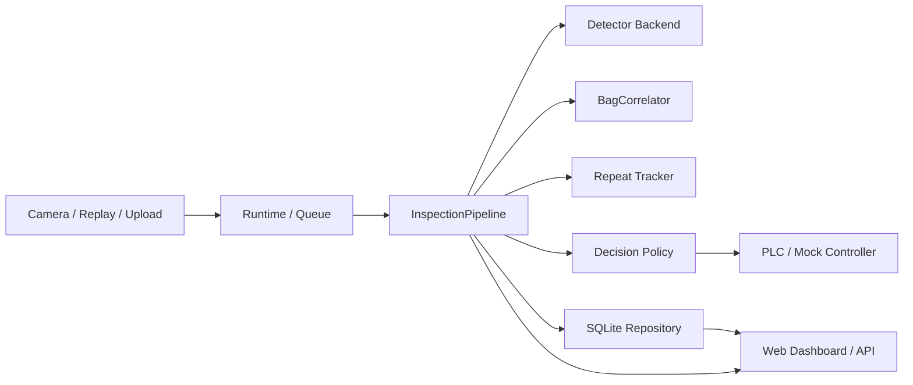

# Waterbag Inspection

> Open-source industrial vision demo for water sampling bag inspection

[](#快速开始)
[](LICENSE)
[](docs/README.md)
[](docs/architecture/README.md)

Waterbag Inspection 是一个面向工业水样采集袋缺陷检测场景的开源演示项目。它不是单纯展示某个 YOLO 模型，而是把一条完整的感知-决策-执行链路整理成了可运行、可复现、可扩展的工程样板。


- 双相机输入
- 一次整图检测 + 二次网格复检
- 袋体级多相机关联
- 重复缺陷识别
- PLC / mock 控制命令下发与 Ack 重试
- Web 实时展示与指标观测
- SQLite 留档、历史回放和故障注入验证
- YOLOv8 / YOLO11 训练与 benchmark 选型入口

[Quick Start](#快速开始) · [Docs](docs/README.md) · [Architecture](docs/architecture/README.md) · [Fault Injection](docs/workflow/fault-injection.md) · [Contributing](CONTRIBUTING.md)

## 为什么开源这个项目

- 它可以在没有真实相机、真实 PLC、真实模型权重的情况下完整演示链路行为
- 它把在线运行、历史回放、故障注入和真实部署统一到同一套 pipeline 和数据模型里
- 它适合作为工业视觉、机器人数据链路、感知执行闭环相关方向的学习和展示样板

## 项目亮点

- 标准化数据链路建模：`FramePacket -> PerceptionResult -> DecisionResult -> ControlCommand -> ExecutionFeedback`
- 双相机袋体级结果聚合，不按单帧而按工件做最终决策
- `pending_timeout_ms` 驱动的等待超时淘汰
- 同机位乱序旧帧忽略，避免旧数据回滚新状态
- PLC Ack / 超时 / 重试控制闭环
- `runtime / replay / manual` 来源隔离的重复缺陷状态
- Web 观测面板，展示 `timeout / ack_retry / stale_frame / plc_failure`
- CLI 支持 `serve`、`seed-demo`、`inspect`、`replay`、`inject-faults`
- SQLite 留档、指标聚合、历史回放和离线故障注入

## 架构速览



这条链路的核心目标不是“单张图有没有检出框”，而是把输入、感知、聚合、决策、控制、反馈和留档串成一条可观测、可回放、可验证的工业视觉闭环。

## 快速开始

### 1. 安装最小演示依赖

```bash
pip install -r requirements-demo.txt
```

如果你希望接入真实模型、训练、Modbus 或更完整的依赖：

```bash
pip install -r requirements.txt
```

### 2. 生成演示样本

```bash
python -m waterbag_inspection seed-demo --output-root demo_data --clean
```

### 3. 启动 Web Demo

```bash
python app.py
```

或者：

```bash
python -m waterbag_inspection serve --config configs/demo.yaml
```

### 4. 打开页面

```text
http://127.0.0.1:5000
```

## 常用命令

```bash
python -m waterbag_inspection serve --config configs/demo.yaml
python -m waterbag_inspection inspect --config configs/demo.yaml --camera-id 1 --image demo_data/camera1/bag_0001_cam1_good.jpg --reset-history
python -m waterbag_inspection replay --config configs/demo.yaml --source-root demo_data --reset-history
python -m waterbag_inspection inject-faults --config configs/demo.yaml --scenario all --output-root artifacts/fault_injection --clean
python train_v8.py --data data/waterbag.yaml --device 0
python train_yolo11.py --data data/waterbag.yaml --device 0
python benchmark_ultralytics_models.py --models runs/train/yolov8_waterbag/weights/best.pt runs/train/yolo11_waterbag/weights/best.pt --data data/waterbag.yaml
```

如果你更习惯用 Makefile，也可以直接使用：

```bash
make install-demo
make serve-docs
make seed-demo
make serve-demo
make replay-demo
make inject-faults
make train-yolov8
make train-yolo11
make benchmark-models
make test
```

## 文档导航

README 只保留开源首页需要的内容。更完整的项目说明、架构分析、算法细节、部署流程和接口文档都放在 [`docs/`](docs) 中。

推荐按下面的路径进入：

- 想先快速跑起来： [文档首页](docs/README.md) / [环境依赖与安装](docs/guide/prerequisites.md) / [启动 Demo](docs/guide/run-demo.md)
- 想理解系统怎么设计： [系统架构总览](docs/architecture/README.md) / [模块全景](docs/architecture/module-overview.md) / [数据流](docs/architecture/data-flow.md)
- 想看核心算法设计： [二阶段缺陷检测](docs/algorithms/two-stage-detection.md) / [袋体级多相机关联](docs/algorithms/bag-correlation.md) / [重复缺陷识别](docs/algorithms/repeat-defect.md)
- 想看模型训练与选型： [YOLOv8 / YOLO11 选型](docs/algorithms/model-selection.md)
- 想接外部系统或页面： [Web API](docs/interfaces/web-api.md)
- 想验证边界场景： [故障注入流程](docs/workflow/fault-injection.md) / [部署流程](docs/workflow/deployment-workflow.md)

如果你想本地打开文档站：

```bash
make serve-docs
```

默认地址：

```text
http://127.0.0.1:5173
```

## 仓库结构

| 路径 | 说明 |
| --- | --- |
| `waterbag_inspection/` | 当前推荐维护的应用层代码 |
| `configs/` | Demo 配置和生产部署模板 |
| `docs/` | 详细项目文档、架构说明和工作流说明 |
| `templates/` | Web 看板页面 |
| `tests/` | 关键链路回归测试 |
| `demo_data/` | Demo 相机输入目录 |
| `artifacts/` | 运行结果、回放和故障注入产物 |
| `train_ultralytics.py` | Ultralytics 通用训练入口 |
| `train_v8.py` | YOLOv8 baseline 训练脚本 |
| `train_yolo11.py` | YOLO11 candidate 训练脚本 |
| `benchmark_ultralytics_models.py` | YOLOv8 / YOLO11 模型对比脚本 |
| `legacy/` | 已归档的旧脚本和旧页面 |
| `detect/`, `models/`, `utils/` | 保留的 YOLOv5 legacy 资产 |

## 这个仓库适合谁

- 想看一个工业视觉 demo 怎样从脚本式代码重构成可维护工程
- 想做机器人感知链路、视觉执行闭环、工业软件项目展示
- 想学习如何把检测模型接到回放、控制、观测和故障验证链路里
- 想把自己的视觉项目包装成更适合简历、开源和面试讲述的工程项目

## Demo 能展示什么

- 双相机正常到齐后整袋 `accept`
- 单侧缺陷命中后整袋立即 `reject`
- 一次整图未命中但二次 patch 复检命中微小缺陷
- 重复缺陷触发 `repeat_alert`
- 单侧缺失触发 `timeout`
- PLC Ack 首次失败后自动重试
- 旧帧迟到被识别为 `stale_frame_ignored`

## 当前范围与说明

- 仓库默认不附带真实生产权重
- `configs/production.example.yaml` 是部署模板，不代表开箱即用
- demo 默认更强调链路结构、状态管理、回放与故障验证，而不是最终检测精度
- 真实上线前仍需接入你的数据集、权重、相机落盘方式和 PLC 参数
- 仓库保留较多原始 YOLO 资产和历史脚本，是为了保留项目演化轨迹，而不是推荐作为当前主入口

## 路线图

- 将 `bag_id` 从文件名推断升级为显式产线触发 ID
- 增加更细粒度的相机掉线、网络延迟和 PLC 故障注入
- 将重复缺陷状态从 JSON 迁移到数据库或缓存
- 增加趋势统计、检索、过滤和报表导出
- 引入真实历史数据做非 mock 回归验证
- 增加 ONNX / TensorRT 导出和部署时延 benchmark

## 参与贡献

欢迎通过 Issue 或 Pull Request 参与改进，比较适合的方向包括：

- 补充真实场景下的 replay 数据与 benchmark 结果
- 改进文档、示例配置和开箱即用体验
- 增强 Web 观测面板和指标查询能力
- 增加更多故障注入场景和测试覆盖
- 优化模型训练、部署导出和推理后端适配

如果你准备提交改动，建议先看 [CONTRIBUTING.md](CONTRIBUTING.md)。


## 许可证

本仓库使用 [`LICENSE`](LICENSE) 中提供的 `AGPL-3.0` 许可证。

如果你计划将本项目用于网络服务、闭源系统或商业场景，请先确认许可证要求。


## 致谢

- 感谢 YOLOv5 / Ultralytics YOLO 生态为训练、推理和导出提供的基础能力
- 感谢这个项目早期在真实工业场景中的探索，它为后续工程化重构提供了真实问题来源
