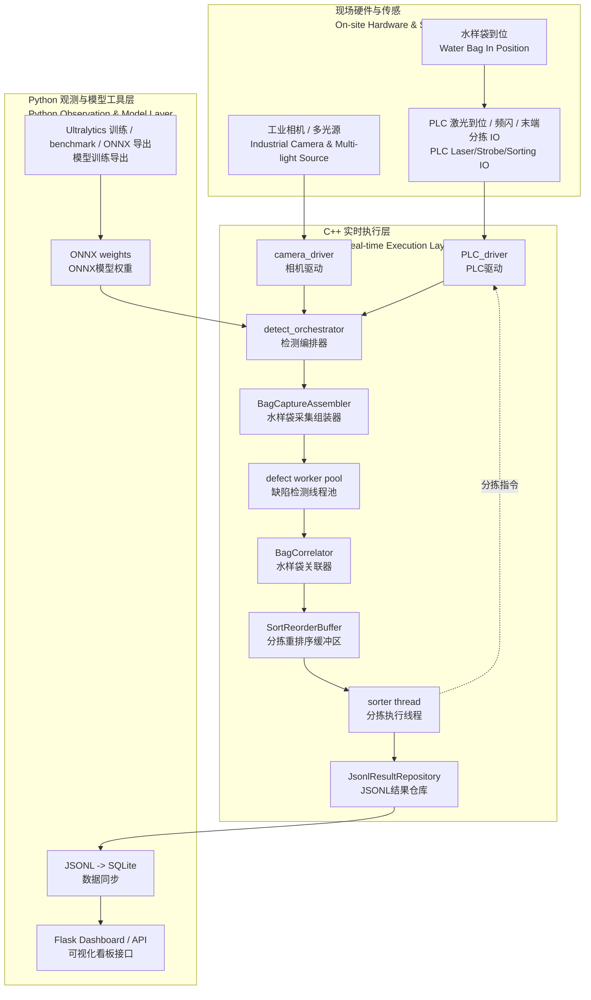

# Waterbag Inspection

> 面向水样检测袋的缺陷检测的工业视觉项目
>
> C++ 实时后端 / 多光源 burst / PLC 顺序分拣 / Python 观测层

[](cpp_backend/README.md)
[](LICENSE)


Waterbag Inspection 把实时采图、光源时序、PLC 交互、袋级组包、缺陷检测、顺序分拣和结果追溯串成一套可运行、可测试、可观测的系统。

实时执行流程放在 C++ 后端，Python 保留给训练、导出、看板和离线观测。当前开源默认使用 mock 相机和 mock PLC 跑通全链路；生产接入时主要替换 `camera_driver` 和 `PLC_driver` 的底层适配器，主流程、数据结构、线程模型和结果落盘方式保持不变。

## 项目背景

水样袋通常是白色、半透明、低对比度的，缺陷可能是针孔、毛发、黑点、异物、压痕、折痕、污染或封边异常（详细可以看项目附加目录中的分类图片）。单张普通正面光图片很容易遇到两个问题：缺陷太浅看不见，或者折痕和反光太像缺陷。
>人工做水袋缺陷检测时是在大背光灯下用手调换不同角度来找缺陷，这中多角度观察微小缺陷的能力对受硬件限制只能平放检测的机器来说是个很大的挑战

因此项目的核心思路和难点不在“模型”，而是把成像和控制先做好：

```text
PLC 激光 presence gate
-> 多光源 burst 采图
-> A/B 面和多光源按 bag_id 齐套
-> stage-1 整图粗检
-> stage-2 微缺陷/patch 精检
-> 袋级融合得到 OK / NG
-> 按物理 BagID 顺序驱动末端分拣
-> JSONL + SQLite + Web 看板留痕
```

## 系统架构



实时链路：

```text
PLC 激光 presence gate
-> 相机 arm burst / PLC start_light_burst
-> 多光源 burst 采图和时序校验
-> A/B 面按 bag_id 齐套
-> stage-1 整图检测
-> stage-2 微缺陷 / patch 检测
-> 袋级融合得到 OK / NG
-> SortReorderBuffer 按物理 BagID 顺序释放
-> sorter thread 下发 end_sorter OK / NG
-> JSONL 结果写盘
```

### 组件职责

- `camera_driver` 只负责相机采图、burst session 和 `CaptureGroup` 组包，不决定 OK/NG。
- `PLC_driver` 只负责激光到位消息、光源 burst、工位拨杆和末端分拣动作，不做视觉判断。
- `detect_orchestrator` 负责 presence gate、袋级状态机、推理调度、结果融合和顺序分拣编排。
- Python 只读 C++ 输出的 JSONL，同步到 SQLite 并提供 Dashboard，不参与产线实时控制。
- 训练和导出的模型通过 ONNX / Ultralytics 进入 C++ 实时后端。

## 项目代码文件

- C++ 实时后端：相机输入、PLC、burst、推理调度、袋级状态机、顺序分拣。
- Python 观测层：读取 C++ JSONL，同步到 SQLite，并提供 Dashboard 和查询接口。
- Python 模型工具：YOLO 训练、benchmark 和 ONNX 导出。
- 文档：从架构、配置、运行到模型工具都有详细讲解。
- demo 数据：可直接用于本地复现和烟测。

## 快速开始

最短路径先跑 mock 链路：

```bash
make build-cpp
make test
make run-cpp-once
make sync-results
make serve-dashboard
```

如果你更喜欢手动命令，也可以直接用 CMake 和 Python：

```bash
cmake -S cpp_backend -B build/cpp_backend
cmake --build build/cpp_backend -j
ctest --test-dir build/cpp_backend --output-on-failure
./build/cpp_backend/waterbag_cpp_service --config config/cpp_backend/demo.ini --once
python -m waterbag_inspection sync-results --config config/cpp_backend/demo.ini
python -m waterbag_inspection serve --config config/cpp_backend/demo.ini
```

默认看板地址是 `http://127.0.0.1:5000`。

## 核心特性

- 默认 mock 相机和 mock PLC，方便先编译、测试、复现流程。
- C++ 是唯一实时链路（高效快速，也方便后续继续做优化），避免 Python Web 和产线控制互相干扰。
- PLC 激光 presence 负责有无袋判断，减少空背景采图和无效推理。
- 两阶段检测把整图粗检和微缺陷补检拆开，适合水样袋这种低对比度场景，并提高效率和准确度。
- 袋级状态机和顺序分拣按物理 BagID 组织，避免并发推理乱序打错袋。
- JSONL + SQLite + Dashboard 提供完整结果记录，便于追踪每一次判定和时序问题。
- ONNX Runtime、Ultralytics 训练和模型导出都保留在仓库里，方便从研究过渡到部署。

## 进一步阅读

如果想了解这套系统为什么这样拆，建议按下面顺序看：

1. [工程文档总览](docs/README.md)
2. [整体架构](docs/architecture/README.md)
3. [C++ 后端](cpp_backend/README.md)
4. [配置说明](docs/configuration/README.md)
5. [运行与验证](docs/operations/README.md)
6. [模型工具](docs/model-tools/README.md)
7. [前端与数据库](docs/frontend/README.md)
8. [清理边界说明](docs/cleanup/README.md)

## 仓库结构

| 路径 | 说明 |
| --- | --- |
| `cpp_backend/` | C++ 实时执行链路、PLC、相机驱动和测试 |
| `waterbag_inspection/` | Python 看板、SQLite 同步和 CLI |
| `config/` | 运行配置、demo 配置和训练数据配置 |
| `docs/` | 站点文档与分主题说明 |
| `demo_data/` | 本地复现用的相机样本目录 |
| `artifacts/` | 运行结果、导出模型和看板数据 |
| `train_*.py` | YOLO 训练入口 |
| `benchmark_ultralytics_models.py` | 模型评测和延迟对比 |
| `export_ultralytics_onnx.py` | 导出 C++ 可加载的 ONNX 模型 |

## 许可证

本仓库使用 [AGPL-3.0](LICENSE) 许可证。
