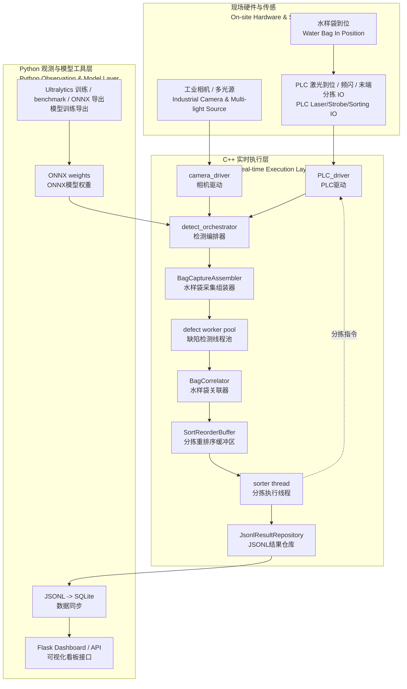
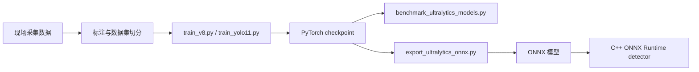

# Waterbag Inspection 文档

Waterbag Inspection 是面向水样袋外观缺陷检测的工业视觉系统。这个页面从实时链路、观测层、模型工具、配置验证和运行方式几个维度，说明整个仓库。

实时执行链路放在 C++ 后端，Python 负责训练、导出、看板和离线观测。仓库默认提供 mock 相机和 mock PLC 跑通全链路，真实设备接入时通过相同接口替换底层适配器即可，主流程、数据结构、线程模型和结果保存方式保持一致。

## 项目定位

水样袋通常是白色、半透明、低对比度的，真实缺陷可能包括针孔、头发丝、黑点、异物、压痕、折痕、污染或封边异常，其中部分缺陷只有 0.1 mm 量级。单张普通正面光图片容易同时遇到两个问题：

- 缺陷太浅，模型看不见。
- 折痕、反光、材质纹理和真实缺陷太像，模型容易误判。

因此，这个项目的技术重点不是单纯把模型做大，而是把成像时序、袋级组包、顺序分拣和结果留痕做成一条稳定的工程链路。

```text
PLC 激光 presence gate
-> 多光源 burst 采图
-> A/B 面和多光源按 bag_id 齐套
-> stage-1 整图粗检
-> stage-2 微缺陷/patch 精检
-> 袋级融合得到 OK / NG
-> 按物理 BagID 顺序驱动末端分拣
-> JSONL + SQLite + Web 看板留痕
```

## 系统分层

| 层 | 技术 | 职责 |
| --- | --- | --- |
| 现场感知层 | PLC / 相机 / 频闪 / 高速 IO | 负责到位检测、burst 触发、曝光同步和末端分拣动作 |
| C++ 实时执行层 | C++17 | 相机输入、PLC presence gate、袋体组包、并发推理、顺序分拣、JSONL 输出 |
| Python 观测层 | Flask / SQLite | 读取 C++ JSONL，同步到 SQLite，提供 Dashboard 和查询接口 |
| Python 模型工具层 | Ultralytics | YOLO 训练、benchmark、ONNX 导出和模型对比 |
| 配置与验证层 | INI / CMake / tests | 管理运行参数、构建选项、线程数、超时、阈值和回归测试 |

## 实时链路



其中两个设计点最关键：

- 缺陷检测可以异步和并发，但末端分拣必须严格按物理袋序执行。
- 任何采图不齐套、光源时序异常、对端相机超时或分拣结果超时，默认走 fail-safe NG。

## 关键组件

| 模块 | 亮点 |
| --- | --- |
| 多光源成像 | 默认每面 3 张：背光、双向暗场、交叉偏振漫射，对针孔、毛发、异物、折痕、反光和淡色污染提供互补信息 |
| 硬触发设计 | 相机先 arm，PLC/频闪控制器一次启动 burst 序列，避免逐帧软件切光源、逐帧保存、逐帧握手造成节拍损失 |
| 时间同步 | `HardwareTimestamp` 和 `UnifiedHardwareClock` 抽象统一硬件时间轴，记录光源 on/off、camera trigger、曝光开始/结束、host receive，并用 jitter tolerance 校验 |
| 袋级状态机 | `bag_id` 是业务主键，A/B 面和每面 3 张 burst 图全部齐套后才进入袋级判断 |
| 两阶段算法 | PLC 激光 presence 只负责有无袋，stage-1 负责整图明显缺陷，stage-2 负责微缺陷或 patch detector 接入口 |
| 多线程实时性 | 目录/相机输入、station worker、defect worker pool、sorter thread、async JSONL writer 分离，减少机构动作被模型推理和磁盘 IO 阻塞 |
| 顺序分拣 | `SortReorderBuffer` 允许推理乱序完成，但末端 PLC 只按物理 BagID 队首释放，避免打错袋 |
| 可观测性 | 每条结果记录 `latency_ms`、`advance_control_ms`、`stage1_ms`、`stage2_ms`、`control_ms`、PLC ack、重试、状态轨迹和最终框 |

## 模型与部署链路



模型在项目里的位置是服务于实时链路，而不是取代实时链路。当前 C++ 后端把视觉模型拆成两个 detector：`primary` 负责 stage-1 整图粗检，`patch` 负责 stage-2 微缺陷补检；presence 由 PLC 激光消息提供，不再由图像模型承担。

## 仓库组成

| 路径 | 说明 |
| --- | --- |
| `cpp_backend/` | C++ 实时执行链路、PLC、相机驱动和测试 |
| `waterbag_inspection/` | Python 看板、SQLite 同步和 CLI |
| `config/` | 运行配置、demo 配置和训练数据配置 |
| `docs/` | 站点文档与分主题说明 |
| `demo_data/` | 本地复现用的相机样本目录 |
| `artifacts/` | 运行结果、导出模型和看板数据 |
| `train_*.py` | YOLO 训练入口 |
| `benchmark_ultralytics_models.py` | 模型评测和延迟对比 |
| `export_ultralytics_onnx.py` | 导出 C++ 可加载的 ONNX 模型 |

## 快速入口

最短路径先跑 mock 链路：

```bash
make build-cpp
make test
make run-cpp-once
make sync-results
make serve-dashboard
```

如果你更喜欢手动命令，也可以直接用 CMake 和 Python：

```bash
cmake -S cpp_backend -B build/cpp_backend
cmake --build build/cpp_backend -j
ctest --test-dir build/cpp_backend --output-on-failure
./build/cpp_backend/waterbag_cpp_service --config config/cpp_backend/demo.ini --once
python -m waterbag_inspection sync-results --config config/cpp_backend/demo.ini
python -m waterbag_inspection serve --config config/cpp_backend/demo.ini
```

默认看板地址是 `http://127.0.0.1:5000`。

## 文档导航

| 页面 | 内容 |
| --- | --- |
| [当前架构](architecture/README.md) | 从传感链路、硬触发、时间同步到算法和观测层的整体架构 |
| [C++ 后端](backend/README.md) | 实时链路、线程模型、袋体组包、模型推理、PLC 动作和结果输出 |
| [前端与数据库](frontend/README.md) | Flask Dashboard、JSONL 增量导入、SQLite 表结构和 API |
| [配置说明](configuration/README.md) | INI 配置、阈值、超时、worker、ONNX Runtime 和环境变量 |
| [模型工具](model-tools/README.md) | 数据集准备、YOLO 训练、benchmark、ONNX 导出和上线口径 |
| [运行与验证](operations/README.md) | 构建、测试、烟测、性能压测和故障排查 |
