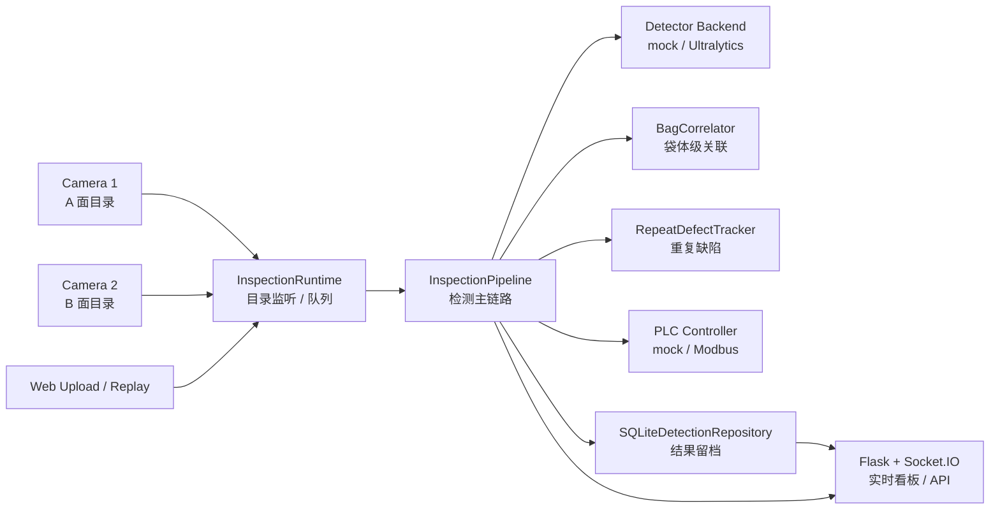

# Waterbag Inspection
----
> 工业水样采集袋缺陷检测闭环系统

## 项目简介

Waterbag Inspection 是一个面向工业水样采集袋质检场景的视觉检测演示系统。项目不只展示目标检测模型，而是把从双相机图像接入、缺陷感知、袋体级多相机关联、PLC 控制指令下发，到 Web 实时展示、结果留档、历史回放和故障注入验证的一整条链路整理成可运行、可复现、可扩展的工程样板。

这个项目适合被理解为一个小型的“感知-决策-执行”闭环系统：

- 感知侧：一次整图检测 + 二次网格复检，兼容 mock、YOLOv8、YOLO11 等模型后端
- 决策侧：袋体级聚合、重复缺陷识别、超时决策、异常帧处理
- 执行侧：PLC / mock 控制命令、Ack 超时、重试和失败观测
- 工程侧：Flask + Socket.IO 看板、SQLite 留档、CLI、回放和故障注入

## 核心功能

- **双相机输入** - 支持 A/B 面相机目录监听，也支持手动上传和离线回放
- **二阶段检测** - Stage 1 整图快速筛查，Stage 2 网格复检捕捉微小缺陷
- **袋体级关联** - 根据 `bag_id` 聚合同一采集袋的多相机结果
- **超时决策** - 一侧相机缺失时按 `pending_timeout_ms` 生成超时判退
- **乱序保护** - 同机位旧帧迟到时忽略，避免状态回滚
- **重复缺陷识别** - 通过历史框 IoU 判断疑似玻璃/夹具污染
- **PLC Ack 重试** - 支持 mock 与 Modbus，记录 attempts、timeout 和失败原因
- **Web 实时展示** - 前端通过 Socket.IO 接收检测图、状态、指标和故障信号
- **历史留档** - SQLite 保存结果、耗时拆解、控制指令、Ack 反馈和状态轨迹
- **故障注入** - 内置 timeout、ack-retry、out-of-order 三类离线验证场景

## 系统架构

## 技术栈

| 组件 | 技术 | 用途 |
| --- | --- | --- |
| Web 服务 | Flask / Flask-SocketIO | 实时看板、HTTP API、Socket.IO 推送 |
| 文件监听 | watchdog | 监听相机输出目录中的新图片 |
| 图像处理 | OpenCV | 图像读取、检测框绘制、demo 图生成 |
| 模型后端 | Ultralytics YOLO | YOLOv8 / YOLO11 训练、验证和推理 |
| 控制执行 | mock / pymodbus | 模拟 PLC 或真实 Modbus RTU 写寄存器 |
| 数据留档 | SQLite | 保存检测结果、控制反馈和诊断指标 |
| 配置管理 | PyYAML / dataclass | YAML 配置加载与运行参数建模 |
| 测试验证 | pytest | pipeline、replay、PLC、故障注入回归测试 |

## 目录一览

| 路径 | 说明 |
| --- | --- |
| `waterbag_inspection/` | 当前推荐维护的应用层代码 |
| `configs/` | Demo 和生产部署配置模板 |
| `templates/` | Web 看板页面 |
| `tests/` | 关键链路回归测试 |
| `demo_data/` | demo 相机输入目录 |
| `artifacts/` | 运行结果、SQLite、回放和故障注入产物 |
| `train_ultralytics.py` | YOLO 统一训练入口 |
| `train_v8.py` | YOLOv8 baseline 训练包装脚本 |
| `train_yolo11.py` | YOLO11 candidate 训练包装脚本 |
| `benchmark_ultralytics_models.py` | YOLOv8 / YOLO11 模型对比脚本 |
| `detect/`, `models/`, `utils/` | 保留的 YOLOv5 legacy 训练/推理资产 |

## 快速导航

- [环境依赖与安装](guide/prerequisites.md) - 准备 Python 环境和依赖
- [启动 Demo](guide/run-demo.md) - 生成样本并打开 Web 看板
- [系统架构](architecture/README.md) - 理解整体链路和分层职责
- [检测主链路](modules/pipeline.md) - 阅读 pipeline 的实际处理步骤
- [二阶段缺陷检测](algorithms/two-stage-detection.md) - 理解 Stage 1 / Stage 2 的取舍
- [YOLOv8 / YOLO11 选型](algorithms/model-selection.md) - 用指标支撑模型升级
- [Web API](interfaces/web-api.md) - 对接外部系统或看板
- [故障注入流程](workflow/fault-injection.md) - 验证 timeout、Ack retry、乱序帧
