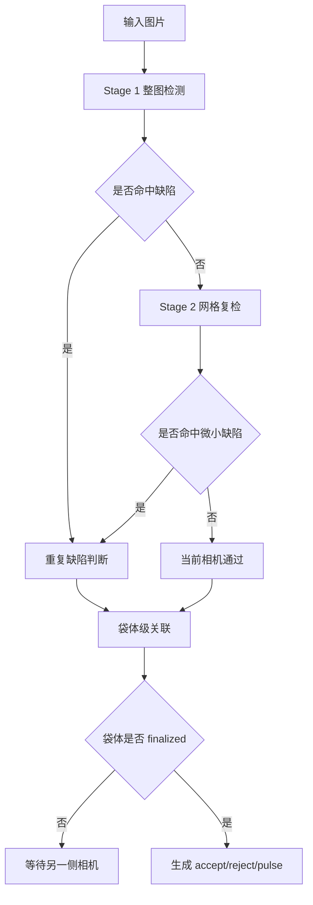

# 算法说明总览

本项目的算法部分不只包含目标检测模型，还包括围绕工业链路稳定性构建的状态判断、关联和异常恢复逻辑。

## 算法组成

| 算法 | 位置 | 目标 |
| --- | --- | --- |
| 二阶段缺陷检测 | `pipeline.py`, `detectors.py` | 兼顾整图效率和微小缺陷召回 |
| 袋体级多相机关联 | `correlation.py` | 将 A/B 面相机结果聚合为袋体决策 |
| 重复缺陷识别 | `repeater.py` | 识别疑似玻璃/夹具污染造成的固定位置缺陷 |
| YOLO 模型选型 | `train_*.py`, `benchmark_ultralytics_models.py` | 支撑 YOLOv8 / YOLO11 的工程选择 |
| 多光源特征级融合 | `models/multilight_fusion.py` | 将背光、暗场、偏振在 P3/P4/P5 上做 cross-light Transformer Fusion |

## 端到端决策逻辑

## 算法边界

本项目默认 demo 使用 mock 检测器，因此可以在没有真实模型和数据的情况下验证链路行为。真实检测效果需要接入生产数据集和训练权重后评估。
