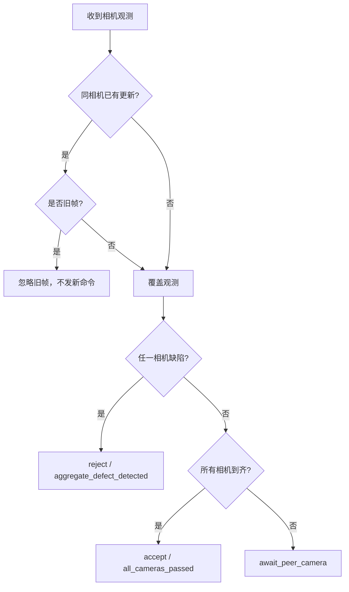

# 袋体级多相机关联

## 背景

采集袋有 A/B 两个观察面。单个相机只能观察局部，最终控制动作应该以“袋体”为单位，而不是以“单帧图片”为单位。

`BagCorrelator` 负责将同一 `bag_id` 的多相机结果聚合为袋体级决策。

## 输入

| 输入 | 说明 |
| --- | --- |
| `FramePacket` | 当前帧 |
| `DecisionResult` | 当前相机局部决策 |
| `PerceptionResult(stage1)` | Stage 1 结果 |
| `PerceptionResult(stage2)` | Stage 2 结果 |

## 会话模型

内部维护 `_BagSession`：

| 字段 | 说明 |
| --- | --- |
| `bag_id` | 袋体 ID |
| `expected_camera_ids` | 预期相机列表 |
| `observations` | camera_id -> 当前观测 |
| `command_issued` | 是否已发过控制命令 |
| `timed_out` | 是否已超时 |
| `final_action` | 最终动作 |
| `final_reason` | 最终原因 |
| `last_updated_monotonic` | 最后更新时间 |

## 决策规则



## 超时规则

当会话满足以下条件时触发超时：

- 关联功能启用
- 尚未发过命令
- 尚未超时
- 至少有一个相机观测
- 距离最后更新超过 `pending_timeout_ms`

超时后：

| 字段 | 值 |
| --- | --- |
| `timed_out` | `true` |
| `decision_finalized` | `true` |
| `aggregate_action` | `timeout_action`，默认 `reject` |
| `aggregate_reason` | `peer_camera_timeout:<missing_ids>` |

## 乱序旧帧保护

同一相机如果已有观测，新帧会和已有观测比较：

1. 优先比较 `source_mtime_ns`
2. 如果没有 mtime，则比较 `received_at`

旧帧被忽略时：

```text
stale_frame_ignored = true
new_command_required = false
```

## 配置

```yaml
correlation:
  enabled: true
  expected_camera_ids: [1, 2]
  hold_non_defect_until_complete: true
  pending_timeout_ms: 1500
  timeout_action: reject
  finalized_retention_ms: 5000
```

| 参数 | 说明 |
| --- | --- |
| `expected_camera_ids` | 一个袋体应该收到哪些相机 |
| `hold_non_defect_until_complete` | 正常结果是否必须等待所有相机到齐 |
| `pending_timeout_ms` | 等待缺失相机的超时时间 |
| `timeout_action` | 超时后的控制动作 |
| `finalized_retention_ms` | 已完成会话保留多久用于识别迟到帧 |
