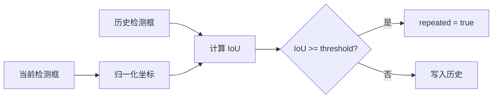

# 重复缺陷识别

## 目标

如果连续多张图在同一相机、相近位置出现类似缺陷，可能不是采集袋本身的问题，而是玻璃、夹具或镜头污染。`RepeatDefectTracker` 用历史检测框 IoU 识别这种情况。

## 判断逻辑



## 历史存储

默认路径：

```text
artifacts/repeat_history.json
```

结构按 namespace 和 camera_id 隔离：

```json
{
  "scopes": {
    "demo:runtime": {
      "1": [[x1, y1, x2, y2, confidence]]
    },
    "demo:replay": {
      "1": [[x1, y1, x2, y2, confidence]]
    }
  }
}
```

## Scope 隔离

`repeat_detection.isolate_by_source=true` 时，历史按来源隔离：

| 来源 | scope |
| --- | --- |
| 在线监听 | `runtime` |
| 历史回放 | `replay` |
| 单图 inspect | `manual` |
| 超时补发 | `timeout_flush` |

这样回放和在线运行不会互相污染重复缺陷历史。

## 配置

```yaml
repeat_detection:
  enabled: true
  history_path: artifacts/repeat_history.json
  history_namespace: demo
  isolate_by_source: true
  iou_threshold: 0.5
  max_entries_per_camera: 50
```

| 参数 | 说明 |
| --- | --- |
| `history_namespace` | 历史命名空间 |
| `iou_threshold` | 判定重复的 IoU 阈值 |
| `max_entries_per_camera` | 每个相机保留的历史框数量 |

## 控制联动

如果 `repeated=true`，`DefaultDecisionPolicy` 会在原本的袋体控制命令外，额外生成：

```text
target = repeat_alert
action = pulse
```

PLC 层会对 `alert` 寄存器发出脉冲，用于提示清洁或人工复查。
