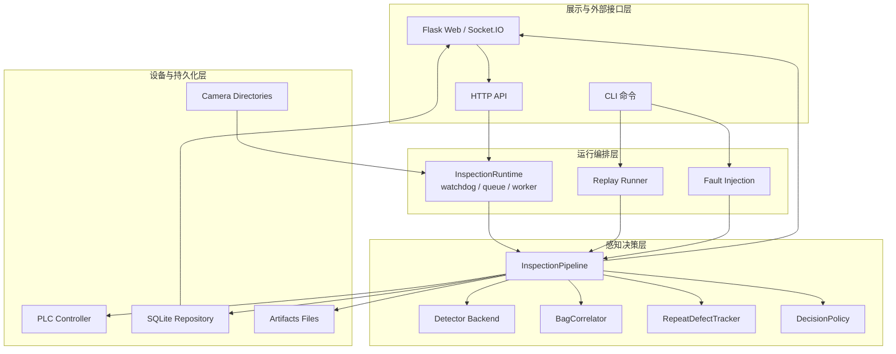

# 架构总览

Waterbag Inspection 采用分层架构，各层通过明确的数据模型连接。核心目标是让 demo、回放、故障注入和真实部署共用同一条 pipeline。

## 分层架构

## 各层职责

### 设备与持久化层

直接面向外部世界：

| 组件 | 职责 |
| --- | --- |
| 相机目录 | 接收工业相机落盘图片 |
| PLC Controller | 将判定结果转为执行指令，支持 Ack/重试 |
| SQLite Repository | 保存检测结果、指标和诊断数据 |
| artifacts 文件 | 保存备份图、结果图、patch 可视化和故障注入产物 |

### 感知决策层

负责单帧到袋体级结果的处理：

| 组件 | 职责 |
| --- | --- |
| `InspectionPipeline` | 串联备份、检测、关联、控制、留档 |
| `BaseDetector` | 检测器接口 |
| `MockDetector` | 基于文件名的 mock 检测器 |
| `UltralyticsDetector` | YOLOv8 / YOLO11 推理后端 |
| `BagCorrelator` | 多相机袋体级聚合 |
| `RepeatDefectTracker` | 重复缺陷 IoU 判定 |
| `DefaultDecisionPolicy` | 决策与控制命令生成 |

### 运行编排层

负责在线和离线输入：

| 组件 | 职责 |
| --- | --- |
| `InspectionRuntime` | 监听相机目录，等待文件稳定，队列化处理 |
| `replay` | 按历史目录构造 `FramePacket` 并复用 pipeline |
| `fault_injection` | 离线构造 timeout、ack-retry、out-of-order 场景 |

### 展示与接口层

负责人机交互和外部系统对接：

| 组件 | 职责 |
| --- | --- |
| Flask 页面 | 实时看板 |
| Socket.IO | 推送 `inspection_update` |
| HTTP API | 控制 runtime、查询状态、上传图片、拉取结果 |
| CLI | serve、seed-demo、inspect、replay、inject-faults |

## 核心设计原则

- **同一 pipeline**：在线、回放、故障注入都走 `InspectionPipeline`
- **模型可替换**：业务链路依赖 `BaseDetector`，不绑定某个 YOLO 版本
- **决策可解释**：每次结果都记录 `decision_reason`、`state_trace` 和耗时拆解
- **设备可模拟**：没有相机、PLC、真实权重时仍可完整演示链路
- **异常可复现**：timeout、Ack retry、乱序帧均有离线注入入口
