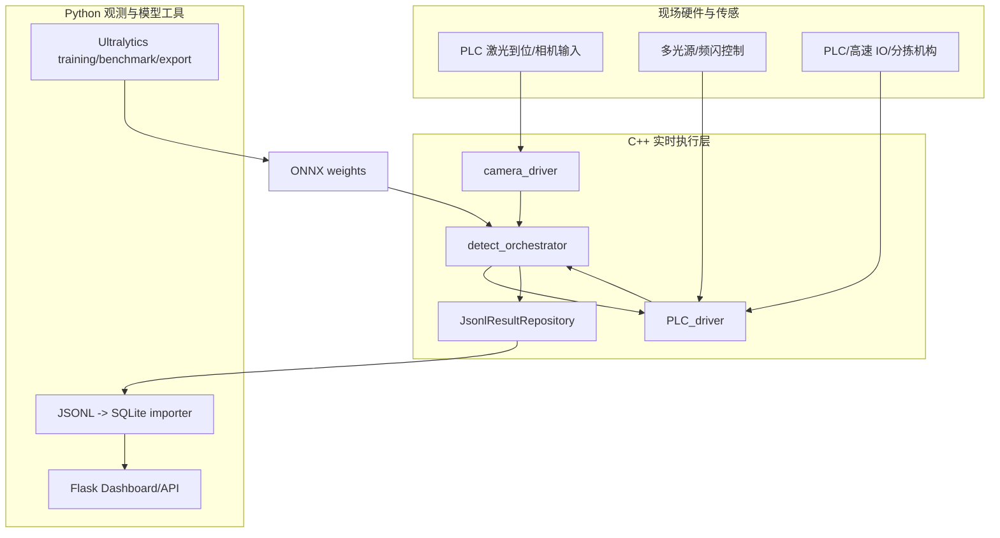

# 当前架构

本项目采用“实时执行”和“观测离线”分层。实时链路放在 C++，因为它要面对相机触发、PLC ack、机械节拍、线程调度和 fail-safe 分拣。Python 保留在更适合它的位置：训练、导出、看板和数据查询。

## 总体分层



| 层 | 关键文件 | 说明 |
| --- | --- | --- |
| 相机传感 | `cpp_backend/camera_driver/` | 相机进入 armed/grabbing 状态，按 burst plan 收集多光源图像，并形成 `CaptureGroup` |
| PLC 控制 | `cpp_backend/PLC_driver/` | 激光到位消息、光源 burst 事件、工位拨杆、末端 OK/NG 分拣、ack 超时和重试 |
| 主流程编排 | `cpp_backend/detect_orchestrator/` | PLC presence gate、采图、组包、推理、袋级融合、顺序分拣、结果落盘 |
| 看板服务 | `waterbag_inspection/` + `templates/` | 增量读取 C++ JSONL 到 SQLite，提供 Web 页面和 API |
| 模型工具 | `train_*.py`、`benchmark_ultralytics_models.py`、`export_ultralytics_onnx.py` | 训练、验证、模型选型、ONNX 导出 |
| 配置 | `config/cpp_backend/demo.ini`、`config/waterbag.yaml` | 实时参数、相机目录、阈值、线程数、模型路径、训练数据集 |

## 三包 C++ 边界

当前 C++ 后端拆成三个主要包，目的是让真实硬件接入时不会把相机 SDK、PLC 寄存器和视觉业务状态机写成一团。

| 包 | 职责 |
| --- | --- |
| `camera_driver` | 相机采图、burst session、frame index、light id、曝光时间、相机帧号、CaptureGroup 组包 |
| `PLC_driver` | 激光到位消息、光源输出事件、相机触发事件、工位拨杆动作、末端分拣、ack/retry/timeout |
| `detect_orchestrator` | 主业务流程、PLC presence、调用相机/PLC、袋体状态机、模型推理、结果融合、顺序分拣、JSONL |

依赖方向是：

```text
detect_orchestrator
  -> camera_driver
  -> PLC_driver
```

`MockCameraBurstCapture` 已放在独立的 `mock_camera_driver` 包中，用于本地复现流程；`camera_driver` 包保留真实海康 MVS 相机实现。生产接入时应保留接口和数据结构，继续把 `MockPlcTransport` 替换为 Modbus/TCP、Modbus/RTU、EtherCAT、高速 IO 卡或现场 PLC SDK。

## 传感链路

真实设备中的传感链路可以理解为一条“到位、锁存、采图、放行”的节拍。

```text
1. 水样袋进入相机工位。
2. PLC 激光检测向主流程发送到位消息，判断当前工位是否有袋。
3. 有袋时生成 capture_session_id，并锁定当前 bag_id、camera_id、side_id；如果 PLC 消息携带 BagID，优先使用 PLC BagID。
4. 相机先 arm burst，准备接收连续帧。
5. PLC/频闪控制器执行 start_light_burst。
6. 多个光源按预设序列点亮，相机连续曝光。
7. 相机包输出 CaptureGroup。
8. 主流程校验光源窗口和触发 jitter。
9. 采图有效后执行工位拨杆动作，水样袋进入下一位置。
10. A/B 面齐套后送入 defect worker。
```

当前默认 burst plan 是每面 3 张：

| 帧 | 光源 | 主要目标 |
| --- | --- | --- |
| frame 0 | `L1_BACKLIGHT` | 头发丝、异物、针孔、透光异常 |
| frame 1 | `L2L3_DUAL_DARKFIELD` | 折痕、划痕、凸起边缘、方向不固定的细线 |
| frame 2 | `L4_CROSS_POLARIZED` | 表面反光抑制、淡色污染、浅色折痕 |

这个光源配置非常关键：水样袋的缺陷可见性高度依赖光源。模型训练再充分，也无法弥补“缺陷在图像里根本不可见”的问题。（感谢中装视觉公司的打光方案）

## 硬触发思路

不推荐生产中采用慢速串行流程：

```text
打开 L1 -> 等待 -> 拍图 -> 保存
打开 L2 -> 等待 -> 拍图 -> 保存
打开 L4 -> 等待 -> 拍图 -> 保存
```

推荐的硬触发或近硬触发流程是：

```text
相机 start_grabbing
-> orchestrator 调用 camera.arm_burst(session, plan)
-> orchestrator 调用 plc.start_light_burst(session, plan)
-> PLC/频闪控制器按 plan 一次执行完整光源和触发序列
-> 相机连续 callback frame0/frame1/frame2
-> CaptureGroup 组包
-> burst_done 后立即放行机构
```

- 微秒级光源和曝光时序尽量交给相机 sequencer、频闪控制器或高速 IO。
- PLC 负责机构安全动作和节拍协调。
- 工控机不参与逐帧闭环，只做 session 管理、图像 callback、元数据校验和推理调度。
- 图像不应在相机 callback 内同步保存或推理，避免阻塞下一帧。

## 时间同步与可追溯

项目记录两类时间：

| 时间类型 | 用途 |
| --- | --- |
| `SystemClock` | 人读日志、结果时间戳、Web 展示 |
| `HardwareTimestamp` / `UnifiedHardwareClock` | 光源、相机曝光、host receive、jitter 校验 |

关键数据结构包括：

| 结构 | 说明 |
| --- | --- |
| `PlcLaserPresence` | PLC 激光到位消息，包含 `bag_present`、消息有效性、超时状态、message_id 和可选 PLC BagID |
| `CaptureSession` | 一次相机工位采图，包含 `capture_session_id`、`bag_id`、`camera_id`、`side_id` 和 burst 起始硬件时间 |
| `PlcBurstEvent` | PLC/频闪侧记录的 `light_on_hw`、`camera_trigger_hw`、`light_off_hw` |
| `BurstImage` | 相机侧记录的 `exposure_start_hw`、`exposure_end_hw`、`host_received_hw` 和 `camera_frame_id` |
| `FrameLightAlignment` | 对齐结果，判断光源是否覆盖曝光窗口、触发 jitter 是否在阈值内 |

同步校验关注的是“每一张图是否真的在正确光源下曝光”，而不是简单追求两台相机同时曝光。校验规则包括：

```text
light_on_hw <= exposure_start_hw
exposure_end_hw <= light_off_hw
abs(exposure_start_hw - camera_trigger_hw) <= jitter_tolerance_us
frame_index 与 light_id 一致
```

如果 `CaptureGroup` 不完整或 `sync_valid=false`，主流程不会把它作为正常 OK 判定输入，而是产生 `capture_invalid` 或 fail-safe NG。真实产线中这比“错光源也继续判 OK”更安全。

## 算法处理链路

视觉算法被拆成两个缺陷阶段，presence gate 由 PLC 激光消息提供：

| 阶段 | 输入 | 输出 | 作用 |
| --- | --- | --- | --- |
| presence | PLC 激光到位消息 | `bag_present` | 快速判断是否有袋，无袋直接跳过采图和缺陷检测 |
| stage-1 | 多光源 burst 子图 | 整图缺陷框 | 筛出明显脏污、破损、黑点、异物 |
| stage-2 | 多光源 burst 子图 | 微缺陷/patch 缺陷框 | 在 stage-1 无缺陷时补查小缺陷 |

`process_station_packet` 负责读取 PLC 激光 presence 消息、采图和工位放行，`process_defect_packet` 负责 stage-1、stage-2、单面融合和袋级关联。这样缺陷检测变慢时不会阻塞工位拨杆动作，水样袋可以继续向后走。

多光源结果在代码中按输入逐张检测，再聚合到同一个 `PerceptionResult`。每个框的 label 会保留光源信息，例如 `defect@L1_BACKLIGHT`，方便后续分析“某类缺陷来自哪路光源”。

## 袋级关联与顺序分拣

单帧检测结果不能直接驱动分拣。项目以 `bag_id` 作为唯一业务主键：

```text
BagID N:
  camera1 / side A / L1_BACKLIGHT
  camera1 / side A / L2L3_DUAL_DARKFIELD
  camera1 / side A / L4_CROSS_POLARIZED
  camera2 / side B / L1_BACKLIGHT
  camera2 / side B / L2L3_DUAL_DARKFIELD
  camera2 / side B / L4_CROSS_POLARIZED
```

核心组件：

| 组件 | 作用 |
| --- | --- |
| `BagCaptureAssembler` | 等待同一 `bag_id` 的 A/B 面 burst 齐套，少任意一路都会等待或超时 |
| `BagCorrelator` | 聚合各相机观测，得出袋级 `accept` / `reject` / `await_peer_camera` / timeout |
| `SortReorderBuffer` | 按水样袋进入设备的物理顺序释放结果，防止并发推理乱序导致分拣错袋 |

默认安全策略：

- A/B 面未齐套超过 `bag_capture_timeout_ms`，输出 NG。
- 对端相机观测超过 `pending_timeout_ms` 未到，按 `timeout_action` 处理，默认 reject。
- 队首袋体超过 `sort_result_timeout_ms` 未拿到推理结果，输出 NG。

## 多线程模型

C++ watch 模式下的线程结构：

| 线程/队列 | 作用 |
| --- | --- |
| `poll_thread` | 扫描相机 watch 目录或接收 SDK 回调输入 |
| `worker_thread` | station 阶段：文件稳定等待、PLC 激光 presence、burst、工位拨杆、采图组包 |
| `defect_threads` | 缺陷推理 worker 池，按 `hash(bag_id) % worker_count` 分片 |
| `sorter_thread` | 执行最终 OK/NG 末端分拣 PLC 动作 |
| JSONL writer thread | 可选异步结果写盘，降低磁盘 IO 对实时链路影响 |

时间优化的关键：

- 机械动作不等缺陷模型。
- 缺陷模型不直接操作末端 PLC。
- JSONL 写盘不阻塞 station worker。
- 同一袋子的任务固定到同一 defect worker，减少同袋状态乱序。
- 最终分拣统一经过 sorter，保持物理顺序。

## 可观测数据流

C++ 输出 `InspectionResult` JSONL。每行包括：

- `bag_id`、`frame_id`、`camera_id`、`source_path`
- `status`、`action`、`reason`、`is_defect`、`finalized`、`timed_out`
- `presence_ms`、`presence_source`、`presence_message_id`、`presence_detail`、`stage1_ms`、`stage2_ms`、`advance_control_ms`、`control_ms`、`latency_ms`
- `control_commands`、`execution_feedbacks`、`ack_attempts`、`ack_retry`
- `boxes`、`state_trace`

Python 看板只读取这些结果，不重新执行检测或控制 PLC。它的价值是提供公开友好的观测入口：最近结果、统计指标、异常信号、原图查看和 JSONL 同步状态。
