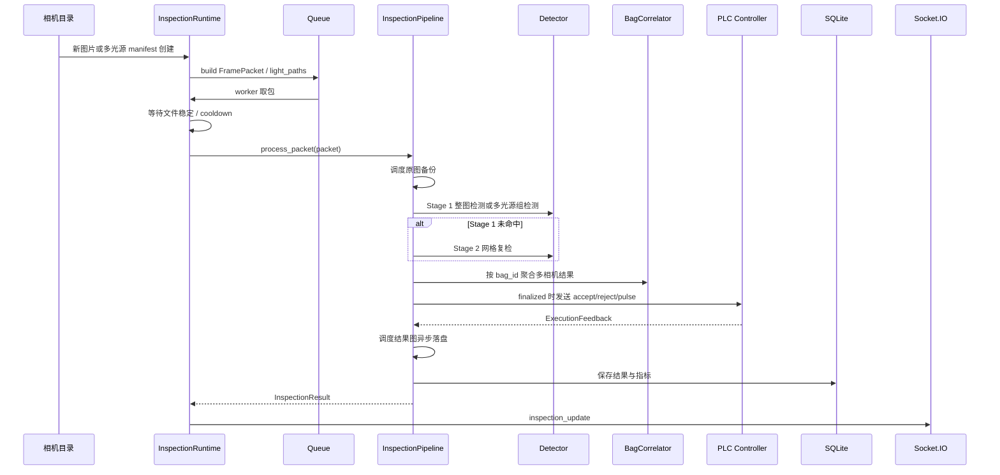

# 数据流

## 在线运行数据流

## 数据对象流转

| 阶段 | 输入 | 输出 |
| --- | --- | --- |
| 接入 | 图片路径 / manifest、相机配置 | `FramePacket` |
| Stage 1 | `FramePacket.source_path` 或 `FramePacket.light_paths` | `PerceptionResult(stage1)` |
| Stage 2 | 原图 patch | `PerceptionResult(stage2)` |
| 重复判定 | 检测框、camera_id、scope | `repeated: bool` |
| 袋体关联 | 局部决策、多相机观测 | `BagSummary` |
| 决策 | 感知结果、袋体聚合 | `DecisionResult` |
| 控制 | `DecisionResult` | `ControlCommand` |
| 执行 | `ControlCommand` | `ExecutionFeedback` |
| 留档 | 全部上下文 | `InspectionResult` |
| artifact | 原图、结果图 | 备份路径、结果图路径；可由后台队列写入 |

## `bag_id` 推断规则

`infer_bag_id()` 从文件名推断袋体 ID：

| 文件名 | 推断 `bag_id` |
| --- | --- |
| `bag_0001_cam1_good.jpg` | `bag_0001` |
| `bag_0001_cam2_good.jpg` | `bag_0001` |
| `bag_0002_front_defect.jpg` | `bag_0002` |
| `custom_name.jpg` | `custom_name` |

这让双相机图片可以通过同一个 `bag_id` 聚合到一个袋体级会话。

## 状态和指标回传

每次结果会包含：

- `frame_id`
- `bag_id`
- `camera_id`
- `status`
- `decision_reason`
- `timing_breakdown`
- `bag_summary`
- `control_commands`
- `execution_feedbacks`
- `state_trace`

Web 页面通过 Socket.IO 的 `inspection_update` 事件获取实时数据，历史表格和指标卡片通过 HTTP API 读取 SQLite。
