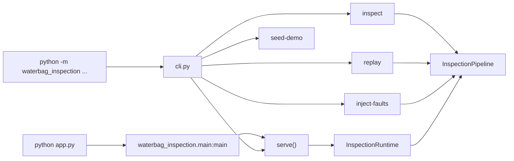

# 模块全景

## 应用层模块

| 文件 | 主要类 / 函数 | 说明 |
| --- | --- | --- |
| `app.py` | `main()` | 兼容入口，调用 `waterbag_inspection.main` |
| `waterbag_inspection/main.py` | `serve`, `build_runtime` | 组装配置、模型、PLC、repository、runtime |
| `waterbag_inspection/cli.py` | `main` | 命令行入口 |
| `waterbag_inspection/config.py` | `load_settings` | YAML 配置加载与路径解析 |
| `waterbag_inspection/schemas.py` | 多个 dataclass | 链路数据模型 |
| `waterbag_inspection/service.py` | `InspectionRuntime` | 目录监听和 worker |
| `waterbag_inspection/pipeline.py` | `InspectionPipeline` | 检测主流程 |
| `waterbag_inspection/detectors.py` | `MockDetector`, `UltralyticsDetector` | 检测器后端 |
| `waterbag_inspection/correlation.py` | `BagCorrelator` | 多相机袋体级关联 |
| `waterbag_inspection/repeater.py` | `RepeatDefectTracker` | 重复缺陷识别 |
| `waterbag_inspection/policy.py` | `DefaultDecisionPolicy` | 业务决策和控制命令 |
| `waterbag_inspection/plc.py` | `ReliablePLCController` | PLC 执行和重试 |
| `waterbag_inspection/storage.py` | `SQLiteDetectionRepository` | SQLite 留档和指标 |
| `waterbag_inspection/replay.py` | `run_replay` | 历史数据回放 |
| `waterbag_inspection/fault_injection.py` | `run_fault_injections` | 故障注入 |

## 训练与评测模块

| 文件 | 说明 |
| --- | --- |
| `train_ultralytics.py` | 通用 Ultralytics 训练入口 |
| `train_v8.py` | YOLOv8 baseline 训练包装 |
| `train_yolo11.py` | YOLO11 candidate 训练包装 |
| `benchmark_ultralytics_models.py` | 对比模型精度、召回和验证耗时 |
| `data/waterbag.yaml` | 默认数据集配置 |

## Legacy 资产

| 路径 | 说明 |
| --- | --- |
| `detect/` | YOLOv5 检测、训练、验证脚本 |
| `models/` | YOLOv5 模型结构 |
| `utils/` | YOLOv5 工具函数 |
| `classify/`, `segment/` | 原始 YOLO 生态保留模块 |
| `legacy/` | 重构前实验脚本和旧页面 |

## 运行入口关系

## 代码阅读建议

第一次阅读建议顺序：

1. `waterbag_inspection/schemas.py`：先理解数据结构
2. `waterbag_inspection/config.py`：理解配置如何注入
3. `waterbag_inspection/pipeline.py`：阅读主链路
4. `waterbag_inspection/correlation.py`：理解袋体级聚合
5. `waterbag_inspection/plc.py`：理解 Ack / retry
6. `waterbag_inspection/webapp.py`：理解 Web API 和推送
7. `tests/`：用测试补全边界行为
