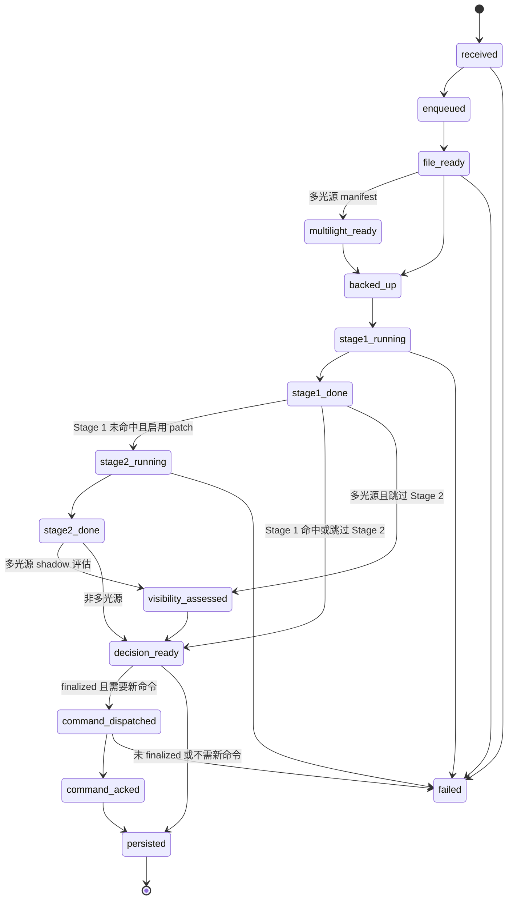

# 状态模型

## PipelineState

每个 `InspectionResult` 都携带 `state_trace`，记录从接收图片到持久化完成的状态轨迹。

| 状态 | 说明 |
| --- | --- |
| `received` | 收到或构造 `FramePacket` |
| `enqueued` | 进入处理队列 |
| `file_ready` | 文件已稳定可读 |
| `multilight_ready` | 多光源 manifest 和三张光源图已就绪 |
| `backed_up` | 原图备份已完成或已调度到异步 artifact 队列 |
| `stage1_running` | Stage 1 整图检测开始 |
| `stage1_done` | Stage 1 完成 |
| `stage2_running` | Stage 2 网格复检开始 |
| `stage2_done` | Stage 2 完成 |
| `visibility_assessed` | 多光源可见性矩阵 shadow 评估完成 |
| `decision_ready` | 决策结果已生成 |
| `command_dispatched` | 控制命令已发送 |
| `command_acked` | 收到 Ack 或重试结束 |
| `persisted` | 结果写入 SQLite |
| `failed` | 处理异常 |

## 主流程状态图

## 袋体级决策状态

`BagSummary.decision_finalized` 是当前袋体是否可以对 PLC 下发最终动作的核心字段。

| 场景 | `decision_finalized` | `aggregate_action` | `aggregate_reason` |
| --- | --- | --- | --- |
| 任一相机检测到缺陷 | `true` | `reject` | `aggregate_defect_detected` |
| 双相机都通过 | `true` | `accept` | `all_cameras_passed` |
| 单侧正常，等待另一侧 | `false` | `await_peer_camera` | `waiting_for_cameras:<ids>` |
| 等待超时 | `true` | `reject` 或配置值 | `peer_camera_timeout:<ids>` |
| 旧帧乱序迟到 | 沿用已有状态 | 不发新命令 | `stale_frame_ignored` |

## 故障信号

`InspectionResult.fault_signals` 会聚合几类诊断信号：

| 信号 | 触发条件 |
| --- | --- |
| `timeout` | 袋体等待缺失相机超时 |
| `ack_retry` | PLC Ack 尝试次数大于 1 |
| `stale_frame` | 同机位旧帧被忽略 |
| `plc_failure` | 执行反馈中存在失败 |

这些信号会进入 Web 看板和 `/api/results/metrics`。
