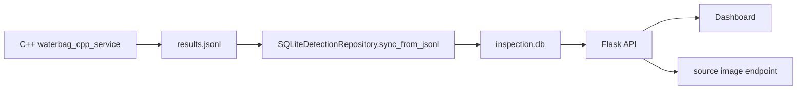

# 前端与数据库

Python 前端是观测层，不参与实时检测、PLC 控制或分拣决策。它的任务是把 C++ 后端已经输出的 JSONL 结果变成大众读者和现场人员能看懂的页面、指标和查询接口。

实时链路由 Python Web 触发，就容易出现请求阻塞、进程重启、浏览器操作影响产线节拍等问题。当前架构中，C++ 服务可以独立长时间运行；看板挂了也不会影响采图和分拣。

## 代码边界

| 文件 | 职责 |
| --- | --- |
| `waterbag_inspection/config.py` | 读取 C++ INI，解析相机目录、JSONL 路径、SQLite 路径和环境变量 |
| `waterbag_inspection/storage.py` | JSONL 增量导入、SQLite 表结构、最近结果和指标统计 |
| `waterbag_inspection/webapp.py` | Flask 页面和 API |
| `templates/index.html` | Dashboard UI，显示相机、指标、最近结果、fault signals |
| `waterbag_inspection/cli.py` | `serve`、`sync-results`、`recent` 命令 |
| `waterbag_inspection/main.py` | 构建 settings、repository，并启动 Flask |

## 数据流



C++ 和 Python 之间的合同只有 JSONL 文件：

- C++ 写入每一条 `InspectionResult`。
- Python 根据 offset 增量读取完整行。
- SQLite 用 `frame_id` 去重 upsert。
- Dashboard 和 API 只读 SQLite 与原图路径。

## SQLite 增量同步

默认数据库：

```text
artifacts/dashboard/inspection.db
```

同步命令：

```bash
python -m waterbag_inspection sync-results --config config/cpp_backend/demo.ini
```

同步器维护 `import_state`：

| 字段 | 说明 |
| --- | --- |
| `path` | 当前同步的 JSONL 绝对路径 |
| `offset` | 已读取到的字节位置 |
| `size` | 上次同步时文件大小 |
| `updated_at` | 同步状态更新时间 |

导入策略：

- 重复运行只读取新增完整行。
- 如果 JSONL 文件变小，认为被截断或轮转，从头同步。
- 如果最后一行还没有换行，认为 C++ 还在写，下一轮再读。
- JSON 解析失败的行会跳过，避免单行坏数据阻断看板。
- `frame_id` 唯一，重复导入会更新同一条记录。

## 表结构

主表 `detection_results` 保留了实时链路最重要的信息：

| 字段 | 来源 | 说明 |
| --- | --- | --- |
| `frame_id` | C++ | 单次结果 ID，唯一 |
| `bag_id` | C++ | 袋体业务主键 |
| `camera_id` / `camera_name` | C++ 配置 | 相机位置 |
| `source_path` | C++ | 原图或 burst 图路径 |
| `status_code` / `status` | C++ + Python 映射 | `ok`、`defect`、`timeout`、`captured`、`no_bag` 等 |
| `decision_action` | C++ | `accept`、`reject`、`await_peer_camera`、`defect_queued` 等 |
| `decision_reason` | C++ | 决策原因，现场排查优先看它 |
| `is_defect` | C++ | 袋级或当前结果是否异常 |
| `timed_out` | C++ | 是否由超时路径生成 |
| `stale_frame_ignored` | C++ | 是否忽略了旧帧 |
| `plc_success` | C++ | PLC 动作是否成功 |
| `ack_attempts` / `ack_retried` | C++ | PLC ack 尝试次数和是否重试 |
| `latency_ms` | C++ | 当前结果总耗时 |
| `advance_control_ms` | C++ | 工位放行动作耗时 |
| `stage1_ms` / `stage2_ms` | C++ | 模型推理耗时 |
| `control_ms` | C++ | 末端分拣动作耗时 |
| `final_boxes` | C++ | 最终缺陷框 JSON |
| `control_commands` | C++ | 计划执行的控制命令 |
| `execution_feedbacks` | C++ | PLC 执行反馈 |
| `state_trace` | C++ | 状态轨迹 |
| `raw_json` | C++ | 原始 JSONL payload |

SQLite 使用 WAL 模式，适合一个进程写入导入、另一个请求读取看板的轻量场景。

## Dashboard 页面

启动看板：

```bash
python -m waterbag_inspection serve --config config/cpp_backend/demo.ini
```

默认地址：

```text
http://127.0.0.1:5000
```

页面展示：

- 当前使用的 C++ 配置文件、JSONL 路径和 SQLite 路径。
- 每个相机的最近状态、最近图片、袋体 ID、框数和 watch 目录。
- 最近结果表，包括状态、动作、原因、ack、PLC、耗时和缺陷框数量。
- 指标卡片，包括 Recent、Defect、Timeout、Ack Retry、Avg Latency、Avg Control。
- JSONL 是否存在。
- 手动同步按钮。
- 上传图片到 C++ watch 目录的辅助入口。

注意：上传入口只复制文件到相机 watch 目录，不执行 Python 检测。要让上传图片被处理，C++ 服务必须以 `--watch` 模式运行。

## API

| 路径 | 方法 | 说明 |
| --- | --- | --- |
| `/api/status` | GET | 当前配置、JSONL 路径、SQLite 路径、相机目录 |
| `/api/results/sync` | POST | 手动触发 JSONL 到 SQLite 同步 |
| `/api/results/recent?limit=40` | GET | 最近结果，默认会先同步 JSONL |
| `/api/results/metrics?limit=80` | GET | 最近 N 条结果的统计指标 |
| `/api/source-image/<frame_id>` | GET | 根据结果中的 `source_path` 查看原图 |
| `/api/demo/upload` | POST | 将图片复制到指定相机 watch 目录 |

`recent` 返回的每行会补充 `fault_signals`：

| 信号 | 条件 |
| --- | --- |
| `timeout` | `timed_out=true` |
| `ack_retry` | PLC ack 有重试 |
| `stale_frame` | 有旧帧被忽略 |
| `plc_failure` | PLC 执行反馈失败 |

这些信号比单纯 OK/NG 更适合现场排查。例如检测为 NG 可能是视觉缺陷，也可能是采图超时、PLC ack 重试或同步异常。

## 配置来源

Python 看板会读取 C++ INI：

```text
config/cpp_backend/demo.ini
```

从中解析：

- `[camera.*]` 的相机 ID、名称和 watch 目录。
- `[storage] result_jsonl` 的 C++ 结果文件路径。

同时支持环境变量覆盖：

| 变量 | 默认值 | 说明 |
| --- | --- | --- |
| `WATERBAG_CPP_CONFIG` | `config/cpp_backend/demo.ini` | 默认 C++ 配置 |
| `WATERBAG_DASHBOARD_DB` | `artifacts/dashboard/inspection.db` | SQLite 路径 |
| `WATERBAG_DASHBOARD_UPLOAD_DIR` | `artifacts/uploads` | 上传暂存目录 |
| `WATERBAG_DASHBOARD_HOST` | `0.0.0.0` | 看板监听地址 |
| `WATERBAG_DASHBOARD_PORT` | `5000` | 看板端口 |
| `WATERBAG_DASHBOARD_NAME` | `Waterbag Inspection Dashboard` | 页面标题 |
