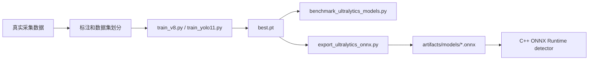

# 模型工具

模型工具保留在 Python 中，用于训练、验证、benchmark 和 ONNX 导出。它们不参与产线实时执行，实时链路只加载导出的模型结果。

## 模型在项目中的位置



C++ 后端把视觉模型分成两个 detector；有无袋 presence 已由 PLC 激光消息提供：

| Detector | 运行阶段 | 建议模型目标 |
| --- | --- | --- |
| `primary` | defect stage-1 | 整图明显缺陷，优先覆盖脏污、破损、异物、黑点 |
| `patch` | defect stage-2 | 微小缺陷或 ROI/patch 模型，关注针孔、毛发、浅色异常 |

开源配置默认使用 `mock` 后端。上线真实模型时，将导出的 ONNX 路径写入 `config/cpp_backend/demo.ini` 对应 detector 段。

## 数据集准备

默认数据集配置：

```yaml
path: ../datasets/waterbag
train: images/train
val: images/val
test:
names:
  0: anomaly
```

推荐目录结构：

```text
datasets/waterbag/
  images/
    train/
    val/
    test/
  labels/
    train/
    val/
    test/
```

真实项目中，建议采集时就保存完整元数据：

```text
bag_id
camera_id
side_id
light_id
frame_index
capture_session_id
exposure_us
gain
trigger_hw_ns
source_path
```

这样后续可以按光源、相机面、缺陷类型、日期、批次和设备状态回溯模型表现。

## 标注建议

水样袋缺陷标注要注意两件事：可见性和一致性。

| 问题 | 建议 |
| --- | --- |
| 微小缺陷太小 | 确保缺陷在图像中至少有足够像素，0.1 mm 缺陷建议达到 5 px 以上，更理想是 8 到 10 px |
| 折痕和缺陷相似 | 标注规范中明确哪些折痕算正常纹理，哪些算 NG |
| 多光源图像同一缺陷表现不同 | 保留 `light_id`，必要时按光源训练或分析 |
| 单类 `anomaly` 太粗 | 早期 OK/NG 可用单类，积累数据后再细分缺陷类别 |
| 数据分布偏 | 按批次、日期、相机、光源和袋型切分训练/验证，避免相邻样本泄漏 |

如果要做更强的多光源模型，可以先从结果级融合开始：每一路光源单独检测，最后做规则融合。后续再考虑三分支特征级融合，但那需要更复杂的模型结构和部署验证。

## 安装依赖

```bash
python -m pip install -r requirements.txt
```

依赖中包含：

```text
Flask
ultralytics
```

训练时还需要根据机器环境安装合适版本的 PyTorch 和 CUDA。

## 训练入口

YOLOv8 baseline：

```bash
python train_v8.py --data config/waterbag.yaml --device 0
```

YOLO11 candidate：

```bash
python train_yolo11.py --data config/waterbag.yaml --device 0
```

两个入口都复用 `train_ultralytics.py`，默认参数：

| 参数 | 默认值 | 说明 |
| --- | --- | --- |
| `--epochs` | 100 | 训练轮数 |
| `--imgsz` | 640 | 输入尺寸 |
| `--batch` | 16 | batch size |
| `--workers` | 8 | dataloader worker |
| `--project` | `runs/train` | 输出目录 |
| `--patience` | 30 | early stopping |
| `--seed` | 42 | 随机种子 |
| `--optimizer` | `auto` | Ultralytics optimizer |
| `--close-mosaic` | 10 | 最后 N 个 epoch 关闭 mosaic |
| `--amp` | true | 自动混合精度 |

可以用 `--extra KEY=VALUE` 传递 Ultralytics 的额外参数：

```bash
python train_v8.py \
  --data config/waterbag.yaml \
  --model yolov8s.pt \
  --imgsz 960 \
  --batch 8 \
  --device 0 \
  --extra lr0=0.005 \
  --extra cos_lr=true
```

## Primary、Patch 的训练口径

建议不要把两个缺陷 detector 完全混成一个训练目标。presence 不再训练图像模型，应由 PLC 激光传感器和 PLC 消息稳定性来保障。

| 模型 | 数据口径 | 指标关注 |
| --- | --- | --- |
| primary | 整袋或主要 ROI 的缺陷框 | 召回、误检、整图延迟 |
| patch | 微小缺陷样本、ROI 或 patch 图 | 针孔/毛发等小目标召回 |

primary 可以先用单类 `anomaly` 快速上线。patch 模型更适合在积累足够微缺陷样本后训练，否则容易过拟合噪声和纹理。

## Benchmark

用同一数据集、同一输入尺寸比较多个模型：

```bash
python benchmark_ultralytics_models.py \
  --models runs/train/yolov8_waterbag/weights/best.pt runs/train/yolo11_waterbag/weights/best.pt \
  --data config/waterbag.yaml \
  --imgsz 640 \
  --batch 1 \
  --device 0 \
  --output artifacts/model_benchmarks.csv \
  --json-output artifacts/model_benchmarks.json
```

输出字段：

| 字段 | 说明 |
| --- | --- |
| `precision` | 精确率 |
| `recall` | 召回率 |
| `map50` | mAP@0.50 |
| `map50_95` | mAP@0.50:0.95 |
| `preprocess_ms` | 预处理耗时 |
| `inference_ms` | 推理耗时 |
| `postprocess_ms` | 后处理耗时 |
| `total_ms` | 三者合计 |
| `weights_mb` | 权重大小 |

上线选型不能只看 mAP。水样袋项目要同时看：

- 漏检率，特别是针孔、毛发、透明异物。
- 误检率，特别是折痕、反光和封边纹理。
- 单张推理延迟和单袋 6 张图总延迟。
- ONNX Runtime C++ 后端实际耗时，而不是只看 Python val speed。
- P95/P99 延迟是否满足末端分拣窗口。

## 两阶段多光源精检

新的离线推理入口把明显缺陷和漏检补偿拆开：

1. Stage 1 保持全图粗检 YOLO，默认只使用 `backlight`。
2. Stage 1 输出 boxes 非空时直接返回，不运行 Stage 2。
3. Stage 1 无框时，Stage 2 对三光源全图同步分块，batch 输入为 `[B, 3, 3, H, W]`。
4. Stage 2 block 结果按 letterbox pad、resize ratio 和 block offset 反算回原图，再做 class-aware NMS。

推理入口：

```bash
python predict_twostage_multilight.py \
  --coarse-model runs/train/coarse/weights/best.pt \
  --fine-model runs/train/fine_multilight/weights/best.pt \
  --source path/to/sample.manifest \
  --coarse-light backlight \
  --imgsz-coarse 640 \
  --imgsz-fine 512 \
  --block-size 512 \
  --block-overlap 0.2 \
  --device 0 \
  --save
```

`--source` 支持单个 manifest、manifest 目录、JSON/JSONL/list 文件。Manifest 的三光源图像必须同尺寸；当前入口会直接报错，不会静默 resize 或复制单张图充当三光源。

Benchmark 入口会输出：

```text
sample_id, coarse_detected, coarse_num_boxes, block_count, final_num_boxes,
coarse_time_ms, tiling_time_ms, fine_inference_time_ms, mapping_time_ms,
nms_time_ms, total_time_ms, precision, recall, map50, map50_95
```

```bash
python benchmark_twostage_multilight.py \
  --coarse-model runs/train/coarse/weights/best.pt \
  --fine-model runs/train/fine_multilight/weights/best.pt \
  --source path/to/manifests \
  --output artifacts/twostage_multilight_benchmark.csv \
  --json-output artifacts/twostage_multilight_benchmark.json
```

如果没有提供 `--metrics-json`，`precision`、`recall`、`map50`、`map50_95` 会保留为空值；计时字段仍会覆盖 Stage 1 命中和 Stage 1 未命中两种路径。

Stage 2 PyTorch 结构位于 `waterbag_inspection/multilight_models.py`：

- `MultiLightFineYOLO`: 三个 Backbone 分支分别提取 P3/P4/P5，融合后接原 YOLO Neck/Head。
- `CrossLightTransformerFusion`: 输入 `[B, C, H, W]` 的三路同尺度特征，reshape 为 `[B * H * W, 3, C]`，只在三光源 token 上做 attention，不做空间全局 attention。

## ONNX 导出

导出命令：

```bash
python export_ultralytics_onnx.py \
  --weights runs/train/yolov8_waterbag/weights/best.pt \
  --output artifacts/models/yolov8_waterbag.onnx \
  --imgsz 640 \
  --device 0 \
  --opset 17 \
  --dynamic \
  --simplify
```

可选参数：

| 参数 | 说明 |
| --- | --- |
| `--dynamic` / `--no-dynamic` | 是否导出动态输入 shape |
| `--simplify` / `--no-simplify` | 是否尝试简化 ONNX 图 |
| `--half` / `--no-half` | 是否半精度导出 |
| `--nms` / `--no-nms` | 是否导出内置 NMS |

C++ 当前 detector 会读取 ONNX 输出并自行做解码和 NMS，因此导出时是否内置 NMS 要和 C++ 解码逻辑匹配。改变导出结构后，务必用 C++ 后端做一次端到端验证。

## 配置到 C++

导出后配置：

```ini
[detector.primary]
backend = onnxruntime_cuda
model_path = artifacts/models/yolov8_waterbag.onnx
use_cuda = true
cuda_device_id = 0
imgsz = 640
nms_iou_threshold = 0.45
max_detections = 100
```

同时构建 C++：

```bash
cmake -S cpp_backend -B build/cpp_backend -DWATERBAG_ENABLE_ONNXRUNTIME=ON
cmake --build build/cpp_backend -j
```

烟测：

```bash
./build/cpp_backend/waterbag_cpp_service --config config/cpp_backend/demo.ini --once
python -m waterbag_inspection sync-results --config config/cpp_backend/demo.ini
python -m waterbag_inspection recent --config config/cpp_backend/demo.ini --limit 5
```

## 模型上线检查表

上线前建议检查：

- 训练集、验证集和现场样本没有泄漏。
- 缺陷类别覆盖真实 NG 形态。
- 多光源图像的 `light_id` 和标注一致。
- ONNX 导出后的 C++ 推理结果和 Python 结果一致或可解释。
- `primary_conf_threshold` 和 `patch_conf_threshold` 已在现场样本上调过。
- 单袋 6 张图推理时间满足分拣窗口。
- 异常路径会默认 NG，而不是因为模型无输出默认 OK。
