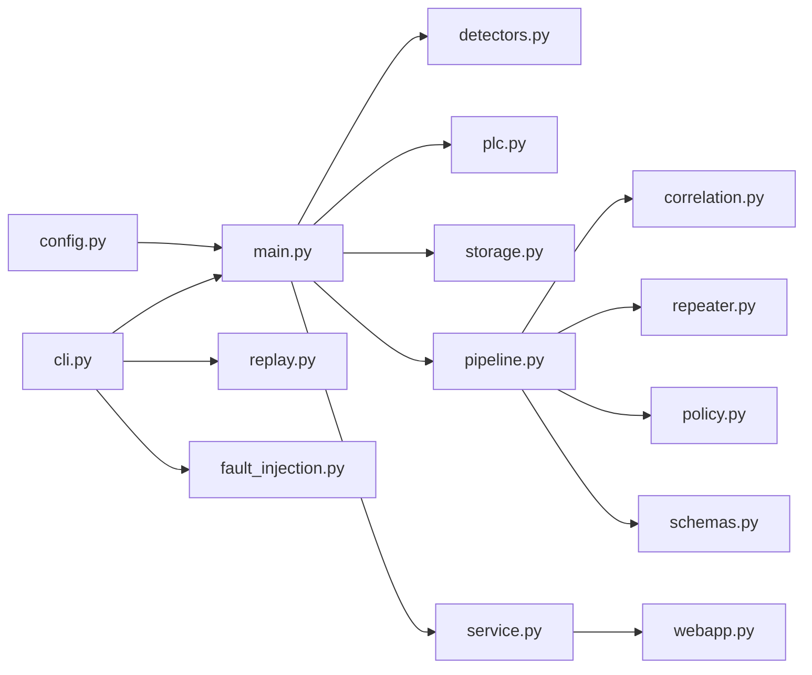

# 模块详解总览

项目的应用层代码集中在 `waterbag_inspection/`。模块之间通过 dataclass 数据模型连接，避免不同入口各自维护一套业务逻辑。

## 模块关系

## 关键模块索引

| 模块 | 文档 | 关注点 |
| --- | --- | --- |
| `pipeline.py` | [pipeline 检测主链路](modules/pipeline.md) | 从图片到控制与留档 |
| `service.py`, `webapp.py` | [运行时与 Web](modules/runtime-web.md) | 在线运行、API、Socket.IO |
| `detectors.py` | [模型后端](modules/detectors.md) | mock / Ultralytics 适配 |
| `plc.py`, `storage.py` | [执行与留档](modules/plc-storage.md) | Ack 重试、SQLite 指标 |

## 设计取舍

- `InspectionPipeline` 不负责目录监听，便于被 CLI、回放和故障注入复用
- `InspectionRuntime` 不关心模型细节，只负责文件稳定性、队列和结果发布
- `DefaultDecisionPolicy` 把业务判定和控制命令生成集中管理
- `BagCorrelator` 独立维护袋体级状态，降低 pipeline 主流程复杂度
- `SQLiteDetectionRepository` 保存结构化 JSON 字段，兼顾查询和调试可读性
