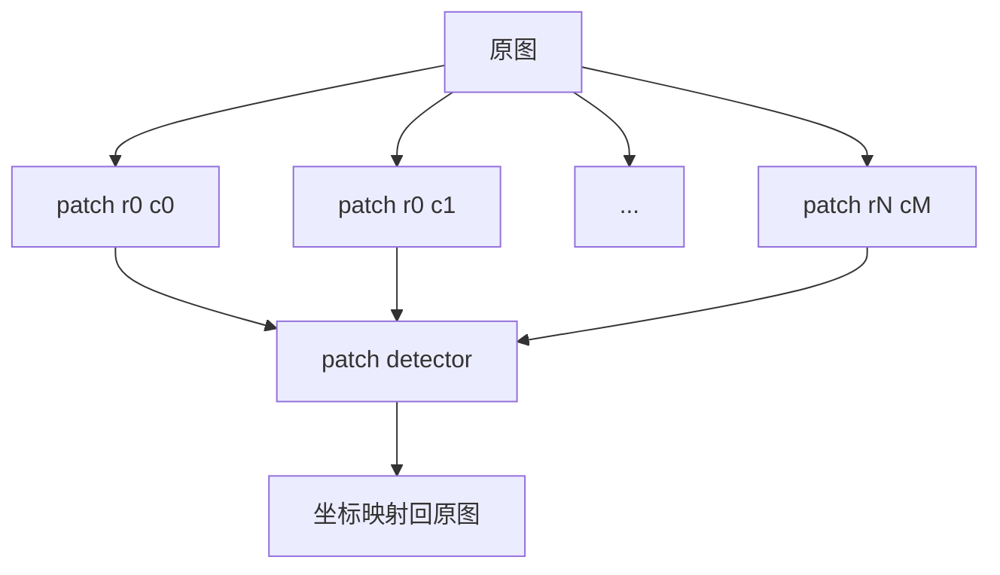

# detectors - 模型后端

## 统一接口

**路径**: `waterbag_inspection/detectors.py`

检测器都实现 `BaseDetector`：

| 方法 | 说明 |
| --- | --- |
| `detect(image_path)` | 整图检测，用于 Stage 1 |
| `detect_patches(image_path, patch_config)` | 网格复检，用于 Stage 2 |

返回值统一为：

```python
tuple[annotated_image, list[DetectionBox]]
```

## MockDetector

`MockDetector` 用于 demo 和测试，不需要真实模型。

### Stage 1 规则

文件名包含以下关键词时模拟一次检测命中：

```text
ng, defect, abnormal, anomaly, dirty, smudge
```

### Stage 2 规则

文件名包含以下关键词时模拟微小缺陷命中：

```text
patch, micro, tiny, pinhole, spot
```

## UltralyticsDetector

`UltralyticsDetector` 用于真实 YOLO 推理：

```python
from ultralytics import YOLO
model = YOLO(model_path)
```

支持：

- `weights_path`: 直接加载 `.pt`
- `encrypted_path + key_path`: 运行时解密到临时 `.pt`
- `imgsz`: 推理尺寸
- `conf_thres`: confidence 阈值
- `iou_thres`: NMS IoU 阈值
- `device`: GPU / CPU 设备

## Patch 检测

Stage 2 会按 `horizontal x vertical` 将原图切成网格：



每个 patch 的检测框会加上 `left/top` 偏移，映射回原图坐标。

## 模型替换建议

如果后续要接入其他推理框架，例如 ONNX Runtime、TensorRT、OpenVINO，建议新增类实现 `BaseDetector`，不要改 `InspectionPipeline`。

推荐命名：

| 后端 | 类名建议 |
| --- | --- |
| ONNX Runtime | `OnnxRuntimeDetector` |
| TensorRT | `TensorRTDetector` |
| OpenVINO | `OpenVINODetector` |

然后在 `build_detector()` 中新增 `backend` 分支。
