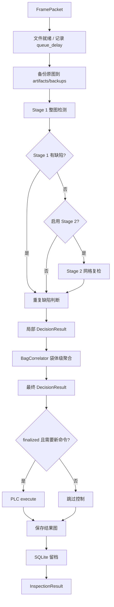

# pipeline - 检测主链路

## 概述

`InspectionPipeline` 是系统最核心的业务链路。它接收 `FramePacket`，完成原图备份、二阶段检测、重复缺陷判断、袋体级关联、控制命令执行、结果图保存和 SQLite 留档。

**路径**: `waterbag_inspection/pipeline.py`

## 构造依赖

| 依赖 | 来源 | 说明 |
| --- | --- | --- |
| `RuntimeConfig` | YAML 配置 | 备份目录、结果目录、上传目录等 |
| `PatchConfig` | YAML 配置 | 二阶段 patch 参数 |
| `CorrelationConfig` | YAML 配置 | 袋体级关联参数 |
| `RepeatConfig` | YAML 配置 | 重复缺陷历史参数 |
| `SQLiteDetectionRepository` | `storage.py` | 结果持久化 |
| `BasePLCController` | `plc.py` | 控制命令执行 |
| `BaseDetector` | `detectors.py` | Stage 1 / Stage 2 检测器 |

## 主流程

## `process_image` 与 `process_packet`

| 方法 | 适用场景 | 行为 |
| --- | --- | --- |
| `process_image(camera, image_path)` | CLI 单图检查、故障注入 | 从相机配置和图片路径构造 `FramePacket` |
| `process_packet(frame_packet)` | 在线 runtime、replay | 使用已有 `FramePacket` 执行完整链路 |

在线运行时，`InspectionRuntime` 会先等待文件稳定，再补齐 `file_ready_at`、`processing_started_at`、`source_mtime_ns`，然后调用 `process_packet()`。

## 耗时拆解

`TimingBreakdown` 记录：

| 字段 | 说明 |
| --- | --- |
| `queue_delay_ms` | 从入队到开始处理的等待时间 |
| `backup_ms` | 原图备份耗时 |
| `stage1_inference_ms` | Stage 1 推理耗时 |
| `stage2_inference_ms` | Stage 2 推理耗时 |
| `decision_ms` | 重复缺陷与局部决策耗时 |
| `correlation_ms` | 袋体关联耗时 |
| `control_ms` | PLC 控制耗时 |
| `persist_ms` | SQLite 持久化耗时 |
| `total_ms` | pipeline 总耗时 |

## 超时处理

`flush_timeouts()` 会调用 `BagCorrelator.collect_timeouts()`，对等待另一侧相机超过 `pending_timeout_ms` 的袋体生成 `TimedOutBagContext`。

超时结果会走 `_build_timeout_result()`：

1. 基于最后一帧构造新的 `timeout-*` frame id
2. 沿用已有 Stage 1 / Stage 2 结果
3. 使用超时后的 `BagSummary`
4. 下发 `timeout_action`
5. 保存结果图和 SQLite 记录

## 输出结果

`InspectionResult` 包含：

- 输入帧信息：`frame_packet`
- 感知结果：`stage1_result`, `stage2_result`
- 决策结果：`decision_result`
- 袋体聚合：`bag_summary`
- 控制命令：`control_commands`
- 执行反馈：`execution_feedbacks`
- 耗时：`timing_breakdown`
- 状态轨迹：`state_trace`
- 图片路径和 base64：`backup_path`, `result_image_path`, `image_base64`
