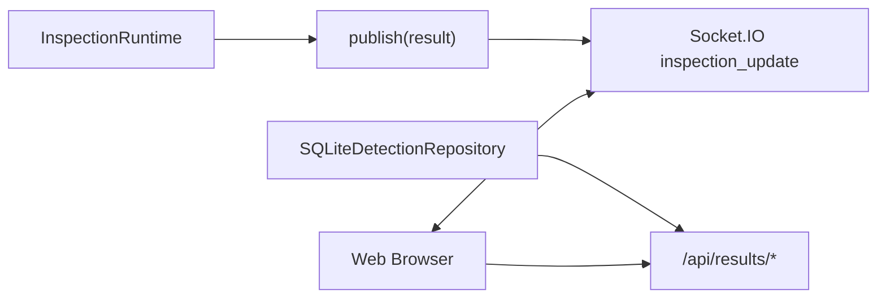

# service / webapp - 运行时与 Web

## InspectionRuntime

**路径**: `waterbag_inspection/service.py`

`InspectionRuntime` 负责在线运行时的输入编排：

- 为每个相机目录创建 `watchdog.Observer`
- 监听 `.jpg/.jpeg/.png/.bmp` 新文件
- 构造 `FramePacket` 并放入队列
- worker 等待文件大小和 mtime 稳定
- 通过 cooldown 控制同相机处理频率
- 调用 `InspectionPipeline.process_packet()`
- 发布结果给已注册 listener
- worker 空闲时定期调用 `pipeline.flush_timeouts()`

## 文件稳定性检查

相机落盘图片时，文件可能尚未写完。`_wait_until_ready()` 会在 `file_ready_timeout_seconds` 内轮询：

| 条件 | 说明 |
| --- | --- |
| 文件存在 | 路径已经可访问 |
| `st_size` 不变 | 文件大小稳定 |
| `st_mtime_ns` 不变 | 修改时间稳定 |
| 持续 `file_stable_seconds` | 认为可读 |

如果超时仍不稳定，runtime 会跳过该文件。

## Web App

**路径**: `waterbag_inspection/webapp.py`

Flask 负责页面和 HTTP API，Socket.IO 负责实时推送。



## 实时事件

事件名：

```text
inspection_update
```

事件 payload 包含：

| 字段 | 说明 |
| --- | --- |
| `frame_id` | 帧 ID |
| `bag_id` | 袋体 ID |
| `status` | 正常 / 异常 / 待确认 / 超时 |
| `image` | 结果图 base64 |
| `bag_summary` | 多相机聚合结果 |
| `state_trace` | 状态轨迹 |
| `timing_breakdown` | 耗时拆解 |
| `fault_signals` | timeout / ack_retry / stale_frame / plc_failure |

## HTTP API

Web API 详见 [接口参考](interfaces/web-api.md)。

## 运行时控制

| 操作 | 入口 |
| --- | --- |
| 启动 runtime | `POST /api/control/start` |
| 停止 runtime | `POST /api/control/stop` |
| 查询状态 | `GET /api/status` |
| 上传图片 | `POST /api/demo/upload` |
| 查询历史 | `GET /api/results/recent` |
| 查询指标 | `GET /api/results/metrics` |
