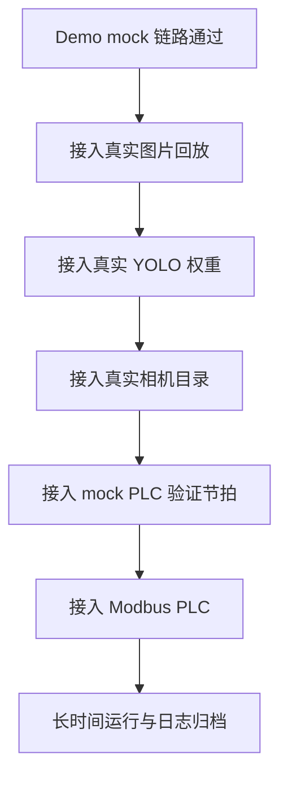

# 部署流程

## 生产接入顺序

建议按以下顺序逐步接入，避免同时引入相机、模型和 PLC 三类变量。



## 1. Demo 链路验证

```bash
make smoke
python -m pytest -q tests
```

## 2. 真实图片离线回放

将现场采集图片整理为：

```text
real_replay/
├── camera1/
└── camera2/
```

执行：

```bash
python -m waterbag_inspection replay \
  --config config/demo.yaml \
  --source-root real_replay \
  --reset-history
```

## 3. 接入真实模型

修改配置：

```yaml
models:
  primary:
    backend: ultralytics
    weights_path: artifacts/models/primary_best.pt
  patch:
    backend: ultralytics
    weights_path: artifacts/models/patch_best.pt
```

先通过单图验证：

```bash
python -m waterbag_inspection inspect \
  --config config/production.example.yaml \
  --camera-id 1 \
  --image real_replay/camera1/sample.jpg
```

## 4. 接入相机目录

确认相机软件能稳定输出图片到 `watch_dir`。启动服务后观察：

```bash
python -m waterbag_inspection serve --config config/production.example.yaml
```

重点观察：

- queue delay 是否可控
- Stage 1 / Stage 2 延迟是否满足节拍
- 是否存在文件未写完导致的读图失败
- `cooldown_seconds` 是否合适

## 5. 接入 PLC

先用 mock PLC 验证判定逻辑，再切到：

```yaml
plc:
  backend: modbus
  enabled: true
```

上线前至少验证：

- accept 正常写入
- reject 正常写入
- repeat_alert pulse 正常
- Ack 超时会重试
- 重试耗尽会记录 `plc_failure`

## 6. 运行维护

生产运行中建议监控：

| 指标 | 说明 |
| --- | --- |
| `avg_latency_ms` | 总处理延迟 |
| `avg_control_ms` | PLC 控制延迟 |
| `timeout_events` | 相机缺帧或匹配异常 |
| `ack_retry_events` | PLC 通信不稳定 |
| `stale_frame_events` | 相机落盘乱序或旧文件重放 |
| `ack_failure_events` | PLC 控制失败 |
