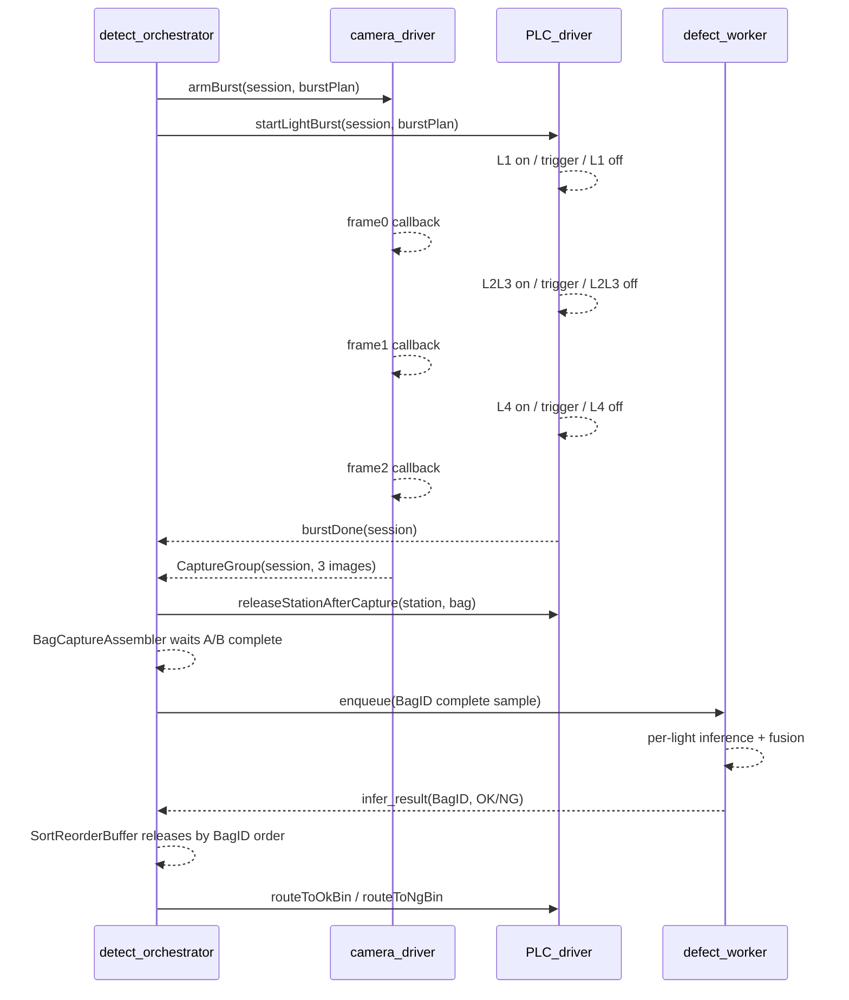

# 多光源 Burst 采图模块与三包 C++ 架构设计

## 1. 设计目标

水样袋缺陷检测中，多光源采图不能设计成慢速串行流程：

```text
切光源 -> 等待 -> 拍图 -> 保存 -> 再切光源 -> 再拍图
```

这样会带来明显节拍损失。更合理的设计是：

```text
一次触发 -> 快速切换光源 -> 相机连续采图 -> 每张图绑定一路光源 -> 异步送入检测队列
```

本模块的目标：

- presence 快速检测只负责判断袋体是否到位。
- 多光源 burst 在一个相机工位内快速完成，不阻塞后续缺陷推理。
- 每张图必须明确对应一个 `light_id`，不能靠文件名或拍摄顺序猜。
- 相机曝光、PLC 光源输出、拨杆动作通过时间戳和事件 ID 对齐。
- 相机与 PLC 的底层流程从主业务中拆出来，形成清晰的 C++ 包边界。

最终 C++ 架构拆成三个包：

```text
camera_driver        相机传感与多光源 burst 采图
PLC_driver           PLC 控制、光源输出、拨杆动作
detect_orchestrator  主流程、状态机、视觉识别推理、结果融合
```

## 2. 三包职责边界

### 2.1 `camera_driver`: 相机传感包

职责：

- 管理工业相机 SDK。
- 相机初始化、参数配置、ROI、曝光、增益、触发模式。
- presence 低延迟采图或低分辨率预览流。
- 多光源 burst 采图过程中的 frame callback。
- 将连续帧组装为 `CaptureGroup`。
- 维护相机时间戳、frame id、曝光时间、光源帧序号。
- 对齐相机帧与 PLC 光源事件。

不负责：

- 不直接决定 OK / NG。
- 不直接控制拨杆。
- 不运行缺陷模型。
- 不知道完整产线业务状态。

核心类建议：

```cpp
class CameraDevice;
class PresenceStream;
class BurstCaptureSession;
class CaptureGroupAssembler;
class TimestampAligner;
class ImageRingBuffer;
```

### 2.2 `PLC_driver`: PLC 控制包

职责：

- 连接 PLC 或高速 IO 控制器。
- 控制光源输出序列。
- 控制相机工位拨杆动作。
- 控制末端分拣拨杆。
- 记录 PLC 命令发送、输出生效、Ack、超时、重试。
- 提供光源 burst 的 `start_burst` / `burst_done` 事件。

不负责：

- 不运行视觉模型。
- 不管理图像 buffer。
- 不做缺陷判断。

核心类建议：

```cpp
class PlcClient;
class LightSequencer;
class LeverController;
class EndSorterController;
class PlcEventRecorder;
```

### 2.3 `detect_orchestrator`: 主流程与视觉推理包

职责：

- 管理水样袋检测状态机。
- 调用 presence 检测。
- 调用相机 burst 采图。
- 调用 PLC 拨杆动作。
- 维护 `bag_id` / `station_id` / `side_id` / `capture_session_id`。
- 将 A/B 两面的 `CaptureGroup` 按 `bag_id` 组装成完整袋体样本后投递给 defect worker。
- 运行缺陷检测模型与多光源融合。
- 聚合上/下两面结果。
- 通过 `SortReorderBuffer` 保证末端 OK / NG 分拣严格按物理 BagID 顺序执行。
- 记录业务日志和检测结果。

不负责：

- 不直接调用相机 SDK 底层接口。
- 不直接操作 PLC 寄存器或 IO 点。
- 不关心具体光源输出脉冲怎么产生。

核心类建议：

```cpp
class StationWorker;
class DefectWorker;
class InspectionStateMachine;
class CaptureScheduler;
class DefectInferencePipeline;
class ResultFusion;
```

## 3. 包依赖关系

建议依赖方向：

```text
detect_orchestrator
  -> camera_driver
  -> PLC_driver

camera_driver 不依赖 PLC_driver
PLC_driver 不依赖 camera_driver
```

原因：

- 避免相机包和 PLC 包互相调用，导致现场问题难以定位。
- 主流程包负责“先 arm 相机，再 start burst，再等待 CaptureGroup”的业务编排。
- 相机包只基于 frame callback 组包。
- PLC 包只基于命令执行 IO 输出和记录事件。

三包之间通过明确数据结构通信：

```text
BurstPlan
BurstStartCommand
PlcBurstEvent
CameraFrameEvent
CaptureGroup
DefectTask
```

## 4. 多光源 Burst 采图核心流程

### 4.1 一次触发，多帧采集

生产推荐流程：

```text
1. orchestrator 检测到 bag_present=true
2. orchestrator 生成 capture_session_id
3. orchestrator 调用 camera.arm_burst(session_id, burst_plan)
4. orchestrator 调用 plc.start_light_burst(session_id, burst_plan_id)
5. PLC / 高速 IO / 频闪控制器执行光源和相机触发序列
6. 相机连续回调 frame0, frame1, frame2
7. camera 包按 frame_index 绑定 light_id
8. camera 包生成 CaptureGroup
9. orchestrator 收到 CaptureGroup 后下发拨杆放行动作
10. `BagCaptureAssembler` 按 `bag_id` 等待 A/B 两面样本齐套
11. 完整袋体样本投递给 defect_queue
```

关键点：

- `start_light_burst` 只调用一次。
- 光源切换不通过上位机逐帧 Modbus 指令完成。
- 相机必须提前进入 armed / grabbing 状态。
- 图像进入内存 ring buffer，不在 burst 中同步写磁盘。

### 4.2 BurstPlan 设计

建议生产默认每面 3 张：

```text
frame_index = 0, light_id = L1_BACKLIGHT
frame_index = 1, light_id = L2L3_DUAL_DARKFIELD
frame_index = 2, light_id = L4_CROSS_POLARIZED
```

原因：

- 背光负责头发丝、异物、针孔、透光异常。
- 双向暗场同时点亮，减少一帧，同时提高折痕和细线可见性。
- 交叉偏振漫射负责浅色污染、反光抑制和淡色表面异常。

速度优先可降级：

```text
frame_index = 0, light_id = L1_BACKLIGHT
frame_index = 1, light_id = L2L3_DUAL_DARKFIELD
```

质量优先可升级：

```text
frame_index = 0, light_id = L1_BACKLIGHT
frame_index = 1, light_id = L2_DARKFIELD_A
frame_index = 2, light_id = L3_DARKFIELD_B
frame_index = 3, light_id = L4_CROSS_POLARIZED
```

### 4.3 建议数据结构

```cpp
enum class LightId {
    L1_BACKLIGHT,
    L2_DARKFIELD_A,
    L3_DARKFIELD_B,
    L2L3_DUAL_DARKFIELD,
    L4_CROSS_POLARIZED
};

struct LightFramePlan {
    int frame_index;
    LightId light_id;
    int exposure_us;
    int gain;
    int light_pulse_us;
    int settle_us;
};

struct BurstPlan {
    std::string plan_id;
    std::vector<LightFramePlan> frames;
};
```

每张图像保存元数据：

```cpp
struct BurstImage {
    std::string capture_session_id;
    std::string bag_id;
    int station_id;
    int camera_id;
    int frame_index;
    LightId light_id;
    std::string image_path;
    uint64_t camera_frame_id;
    int64_t camera_timestamp_ns;
    int64_t exposure_start_ns;
    int64_t exposure_end_ns;
    int64_t host_rx_ns;
};
```

一个相机工位一次 burst 形成：

```cpp
struct CaptureGroup {
    std::string capture_session_id;
    std::string bag_id;
    int station_id;
    int camera_id;
    std::string side_id;  // upper_side / lower_side
    BurstPlan burst_plan;
    std::vector<BurstImage> images;
    bool complete;
};
```

完整袋体样本必须由两个相机位置共同组成：

```text
BagID 1024:
  camera1 / side A / L1_BACKLIGHT
  camera1 / side A / L2L3_DUAL_DARKFIELD
  camera1 / side A / L4_CROSS_POLARIZED
  camera2 / side B / L1_BACKLIGHT
  camera2 / side B / L2L3_DUAL_DARKFIELD
  camera2 / side B / L4_CROSS_POLARIZED
```

生产现场建议由 PLC 递增编号生成 `bag_id`，这样 `bag_id` 同时代表水样袋进入设备的物理顺序。demo 或离线回放可以从文件名推导 `bag_id`，但真实设备中不建议依赖文件名作为主键。

## 5. 统一硬件时间轴与相机/PLC 光源时间同步

### 5.1 同步目标

这里的同步不是为了两台相机同时曝光，而是为了让两个相机、PLC、工控机这四个部件处在同一条可追溯时间轴上，并保证：

```text
frame0 一定是在 L1 背光下拍到
frame1 一定是在 L2/L3 双暗场下拍到
frame2 一定是在 L4 偏振漫射下拍到
拨杆动作一定发生在 burst 最后一帧曝光完成之后
```

统一时间轴中的四类事件：

```text
camera1 exposure_start / exposure_end
camera2 exposure_start / exposure_end
PLC light_on / camera_trigger / light_off / lever_action
IPC image_received / group_assembled / queue_push
```

统一时间轴建议使用：

```text
PTP / IEEE1588 硬件同步
或相机硬件时钟 + PLC 高速 IO 时间戳 + IPC 单调时钟校准 offset
或统一触发控制器输出的全局 tick
```

代码中对应抽象：

```cpp
struct HardwareTimestamp {
    long long ns;
};

class UnifiedHardwareClock {
public:
    static HardwareTimestamp now();
    static long long now_ns();
    static std::string source_name();
};
```

真实设备接入时，`UnifiedHardwareClock` 不应该只用系统 wall clock，而应该绑定现场统一硬件时钟源。

### 5.2 需要记录的事件

PLC 包记录：

```cpp
struct PlcBurstEvent {
    std::string capture_session_id;
    std::string plan_id;
    int frame_index;
    LightId light_id;
    HardwareTimestamp plc_light_on_hw;
    HardwareTimestamp plc_camera_trigger_hw;
    HardwareTimestamp plc_light_off_hw;
    int64_t plc_light_on_ns;
    int64_t plc_camera_trigger_ns;
    int64_t plc_light_off_ns;
};
```

相机包记录：

```cpp
struct CameraFrameEvent {
    std::string capture_session_id;
    int frame_index;
    uint64_t camera_frame_id;
    HardwareTimestamp camera_exposure_start_hw;
    HardwareTimestamp camera_exposure_end_hw;
    HardwareTimestamp host_rx_hw;
    int64_t camera_exposure_start_ns;
    int64_t camera_exposure_end_ns;
    int64_t host_rx_ns;
};
```

对齐结果：

```cpp
struct FrameLightAlignment {
    std::string capture_session_id;
    int frame_index;
    LightId expected_light_id;
    uint64_t camera_frame_id;
    bool light_on_before_exposure;
    bool light_off_after_exposure;
    bool within_jitter_tolerance;
    int64_t light_to_exposure_delta_us;
    int64_t trigger_to_exposure_jitter_us;
    int64_t exposure_to_host_rx_delta_us;
};
```

### 5.3 时间源优先级

优先级：

```text
1. 相机硬件 timestamp / chunk timestamp
2. PLC 或高速 IO 控制器事件 timestamp
3. 工控机 CLOCK_MONOTONIC_RAW
4. 系统 wall clock，仅用于日志展示
```

如果相机和 PLC 没有统一硬件时钟，建议：

- 工控机记录所有命令发送和回调接收时间。
- 通过示波器标定 PLC 输出到光源点亮的固定延迟。
- 通过相机 chunk timestamp 获取曝光时刻。
- 在软件中保存校准出的 offset。

对齐公式示例：

```text
estimated_light_on_host_ns =
  host_send_start_burst_ns + plc_output_delay_ns + frame_light_offset_ns

exposure_center_ns =
  camera_exposure_start_ns + exposure_time_ns / 2

light_to_exposure_delta_ns =
  exposure_center_ns - estimated_light_on_host_ns
```

### 5.4 同步校验规则

每一帧都要校验：

```text
plc_light_on_ns <= camera_exposure_start_ns
camera_exposure_end_ns <= plc_light_off_ns
frame_index 与 light_id 一致
burst_done_ns >= last_frame_exposure_end_ns
lever_release_ns >= burst_done_ns
abs(camera_exposure_start_ns - plc_camera_trigger_ns) <= jitter_tolerance_us
```

如果不满足，当前 CaptureGroup 标记为：

```text
sync_warning
```

严重错位时标记为：

```text
capture_invalid
```

`capture_invalid` 不应该进入最终 OK 判定，可以触发复拍或报警。

### 5.5 I/O jitter 处理

I/O jitter 的来源：

- PLC 高速输出点抖动。
- 频闪控制器响应延迟波动。
- 相机触发输入响应延迟波动。
- 工控机线程调度和 SDK callback 延迟。
- 网口/USB 传输拥塞导致的 host receive 时间波动。

处理原则：

```text
控制链路看硬件事件时间，不看软件日志时间。
图像与光源绑定看 frame_index + hardware timestamp 双重校验。
只要 jitter 超阈值，当前 CaptureGroup 不进入正常 OK 判定。
```

建议配置：

```text
jitter_tolerance_us:
  初始值 200 us
  用示波器或高速采集卡标定后再收紧

light_window_guard_us:
  光源提前量至少覆盖最坏触发抖动
  light_on <= exposure_start - guard
  light_off >= exposure_end + guard
```

软件处理：

```cpp
trigger_to_exposure_jitter_us =
  camera_exposure_start_hw - plc_camera_trigger_hw;

within_jitter_tolerance =
  abs(trigger_to_exposure_jitter_us) <= jitter_tolerance_us;

if (!within_jitter_tolerance) {
    CaptureGroup.status = capture_invalid;
    skip_defect_queue();
}
```

这样即使出现偶发 I/O 抖动，也不会把错光源或曝光窗口不完整的图片送入缺陷检测流程。

## 6. 高速实现策略

### 6.1 PLC 只发一次 burst

慢方案：

```text
上位机发 L1_on
上位机触发相机
上位机发 L1_off
上位机发 L2_on
...
```

推荐方案：

```text
orchestrator -> plc.start_light_burst(session_id, plan_id)
PLC 内部或频闪控制器按 plan_id 执行完整序列
```

PLC/频闪控制器中预先固化：

```text
frame0: L1_on -> trigger_camera -> L1_off
frame1: L2L3_on -> trigger_camera -> L2L3_off
frame2: L4_on -> trigger_camera -> L4_off
```

### 6.2 相机提前进入 armed 状态

不要在每次检测到袋子后才打开相机采集。

推荐：

```text
系统启动:
  camera.open()
  camera.set_trigger_mode()
  camera.start_grabbing()

每次 burst:
  camera.arm_burst(session_id, expected_frame_count)
  等待 frame callback
```

这样减少相机启动、SDK 状态切换、buffer 分配带来的延迟。

### 6.3 图像不在 callback 中落盘

相机 callback 只做：

```text
读取 frame_id
读取 camera timestamp
绑定 capture_session_id
写入 ring buffer
通知 CaptureGroupAssembler
```

不做：

```text
图像保存
模型推理
复杂 OpenCV 转换
大量日志
```

图像保存交给后台 storage worker，缺陷推理交给 defect worker。

### 6.4 ROI 和曝光固定

为了让 burst 更快：

- 使用硬件 ROI，减少 sensor readout 行数。
- 固定 exposure / gain。
- 禁用自动曝光、自动增益、自动白平衡。
- 使用高亮频闪，缩短曝光时间。
- 每个 light_id 预设一套 exposure。

示例：

```text
L1_BACKLIGHT:
  exposure_us = 100
  pulse_us = 120

L2L3_DUAL_DARKFIELD:
  exposure_us = 200
  pulse_us = 240

L4_CROSS_POLARIZED:
  exposure_us = 600
  pulse_us = 700
```

## 7. 三包接口设计

### 7.1 `camera_driver` 对外接口

```cpp
class ICameraBurstCapture {
public:
    virtual void configure(const CameraConfig& config) = 0;
    virtual void start() = 0;
    virtual void armBurst(const CaptureSession& session, const BurstPlan& plan) = 0;
    virtual std::optional<CaptureGroup> pollCompletedGroup() = 0;
};
```

相机包输出：

```text
CaptureGroup
CameraFrameEvent
FrameLightAlignment
```

### 7.2 `PLC_driver` 对外接口

```cpp
class IPlcController {
public:
    virtual PlcAck startLightBurst(const CaptureSession& session, const BurstPlan& plan) = 0;
    virtual PlcAck releaseStationAfterCapture(int station_id, const std::string& bag_id) = 0;
    virtual PlcAck routeToOkBin(const std::string& bag_id) = 0;
    virtual PlcAck routeToNgBin(const std::string& bag_id) = 0;
    virtual std::vector<PlcBurstEvent> readBurstEvents(const std::string& capture_session_id) = 0;
};
```

PLC 包内部可以将 `releaseStationAfterCapture` 展开成：

```text
cameraN_bottom_lever:release_bag_after_capture
cameraN_upper_lever:push_bag_after_capture
cameraN_upper_lever:restore_after_push
cameraN_bottom_lever:restore_blocking_position
```

这样 orchestrator 不需要关心每个 IO 点，只调用一个语义动作。

### 7.3 `detect_orchestrator` 主流程接口

```cpp
class StationWorker {
public:
    void onPresenceDetected(const PresenceResult& presence);
};
```

伪代码：

```cpp
void StationWorker::onPresenceDetected(const PresenceResult& presence) {
    CaptureSession session = makeSession(presence);
    BurstPlan plan = burstPlanProvider.planForStation(presence.station_id);

    camera.armBurst(session, plan);
    plc.startLightBurst(session, plan);

    CaptureGroup group = camera.waitCompletedGroup(session.id);
    auto plc_events = plc.readBurstEvents(session.id);
    auto alignment = timestampAligner.align(group, plc_events);

    if (!alignment.valid) {
        markCaptureInvalid(group, alignment);
        return;
    }

    plc.releaseStationAfterCapture(session.station_id, session.bag_id);
    defectQueue.push(group);
}
```

## 8. 端到端时序图



### 8.1 BagID 驱动的分拣重排

这个项目最大的工程风险不是单张图是否能推理，而是推理乱序后单个末端分拣拨杆打错袋子。两个相机、三种光源、A/B 面和四线程推理同时存在时，不能用“哪个推理先完成就先输出”的策略。

建议将业务主线设计为：

```text
PLC 生成递增 BagID
-> A 面 burst 完成
-> B 面 burst 完成
-> 6 张图齐套
-> 袋级推理 / 袋级融合
-> infer_result_map[BagID] = OK / NG / Timeout / ImageLost
-> 末端分拣按 BagID 物理顺序释放
```

每张图必须携带：

```text
BagID
Side = A / B
Light = Backlight / Darkfield / CrossPolar
CameraID
FrameID
TriggerTimestamp
EncoderPosition
```

`BagCaptureAssembler` 的职责：

- 以 `bag_id` 建立采图上下文。
- 接收 camera1 的 A 面 burst 和 camera2 的 B 面 burst。
- 检查每面是否满足 `expected_burst_images_per_camera = 3`。
- 检查 `burst.sync_valid = true`。
- 只有 6 张图都齐套才进入缺陷检测队列。
- 超过 `bag_capture_timeout_ms` 仍不齐套时，输出 `ImageLost / Timeout`，默认 NG。

`SortReorderBuffer` 的职责：

- 袋体进入时按物理顺序登记 `bag_id`。
- 四个 defect worker 可以乱序返回推理结果。
- `result_map[bag_id]` 只负责保存结果，不直接驱动 PLC。
- 只有队首 `bag_id` 已有结果时，才允许执行末端分拣。
- 队首超过 `sort_result_timeout_ms` 仍没有结果时，默认 NG 或异常通道。

伪代码：

```cpp
sort_reorder.register_bag(frame_packet);

// worker 线程乱序完成
sort_reorder.store_result(infer_result);

// 末端分拣只看队首
for (auto& result : sort_reorder.collect_ready()) {
    pipeline.execute_sort_command(result);
}
```

这种设计把视觉推理吞吐和机械分拣顺序解耦：推理可以并行、可以乱序，拨杆动作必须严格按 BagID 顺序执行。工业安全策略上，超时默认 NG，而不是默认 OK。

## 9. 异常处理

### 9.1 少帧

现象：

```text
expected_frame_count = 3
received_frame_count = 2
```

处理：

- 当前 `CaptureGroup` 标记为 `incomplete`。
- 不进入正常缺陷判定。
- 可以复拍一次。
- 复拍失败后报警或走 NG。

### 9.2 光源错位

现象：

```text
frame1 应该对应 L2L3，但 timestamp 显示曝光发生在 L1 输出窗口内
```

处理：

- 标记 `light_frame_mismatch`。
- 禁止直接用于 OK 判定。
- 记录 PLC event、camera event 和 offset。

### 9.3 burst 超时

现象：

```text
startLightBurst 后超过 timeout 仍未收到所有帧
```

处理：

- camera 包返回 `burst_timeout`。
- orchestrator 决定复拍或报警。
- PLC 不应一直等待图像保存，只等待 burst_done 或 timeout。

### 9.4 图像队列堆积

现象：

```text
defect_queue 长度持续增长
```

处理：

- station worker 仍可继续工作，但需要监控末端分拣前是否来得及出结果。
- 超过阈值时降低采图模式，例如从 3 张/面降为 2 张/面。
- 或触发产线降速。

## 10. 推荐 C++ 目录结构

```text
cpp_backend/
  camera_driver/
    include/camera_driver/
      camera_device.hpp
      burst_capture.hpp
      capture_group.hpp
      timestamp_aligner.hpp
      image_ring_buffer.hpp
    src/
      camera_device.cpp
      burst_capture.cpp
      capture_group.cpp
      timestamp_aligner.cpp

  PLC_driver/
    include/PLC_driver/
      plc_client.hpp
      light_sequencer.hpp
      lever_controller.hpp
      end_sorter.hpp
      plc_events.hpp
    src/
      plc_client.cpp
      light_sequencer.cpp
      lever_controller.cpp
      end_sorter.cpp

  detect_orchestrator/
    include/detect_orchestrator/
      station_worker.hpp
      defect_worker.hpp
      inspection_state_machine.hpp
      result_fusion.hpp
    src/
      station_worker.cpp
      defect_worker.cpp
      inspection_state_machine.cpp
      result_fusion.cpp
```

实际落地时也可以先在一个 CMake 工程里生成三个静态库：

```cmake
add_library(camera_driver ...)
add_library(PLC_driver ...)
add_library(detect_orchestrator ...)
```

依赖关系：

```cmake
target_link_libraries(detect_orchestrator
  PRIVATE
    camera_driver
    PLC_driver
)
```

缺陷检测 worker 池建议放在 `detect_orchestrator` 包内：

```text
defect_worker_count 默认 4
worker_index = hash(bag_id) % defect_worker_count
```

这样同一个水样袋的上/下面图像一定进入同一个 defect worker，保证袋体级聚合顺序稳定；多个不同水样袋可以落到不同 worker 上并行推理。前端设置页可以修改 `runtime.defect_worker_count`，服务重启或下发启动参数后生效。

## 11. 简历表述

可以写成：

> 设计多光源 burst 采图模块，将单次抓拍扩展为一次触发、多路光源快速切换、连续采集多帧的高速采图流程；通过 `capture_session_id + frame_index + light_id + camera timestamp + PLC event timestamp` 绑定每张图与光源状态，保证背光、双向暗场、偏振漫射图像可追溯、可校验。

也可以更偏 C++ 架构：

> 将工业视觉后端拆分为 `camera_driver`、`PLC_driver`、`detect_orchestrator` 三个 C++ 包，其中相机包负责传感与多光源 burst 组包，PLC 包负责光源序列和拨杆动作，编排包负责 presence gate、异步缺陷推理、双面结果融合和末端分拣，降低相机/PLC 底层时序与业务流程耦合。
